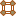
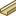

# Диалоговое окно Топология — <Имя проекта>

Вы открыли проект. Данные проекта > Топология > Навигатор.

В этом диалоговом окне вы можете управлять сетями соединенных сегментов, определенными в данном проекте, а также обрабатывать их.

Обзор основных элементов диалогового окна:

В представлениях в виде ***дерева*** и ***списка*** отображаются элементы сетей соединенных элементов: сегменты маршрутизации, точки маршрутизации и цели — с полной структурой идентификаторов. В качестве цели отображаются только функции топологии, но не цельные устройства.

В ***представлении в виде списка*** можно отображать дополнительные свойства, доступные для сетей соединенных сегментов и устройств.

В представлении структуры дерева навигатора топологии отображаются в том числе следующие пиктограммы:

Пиктограмма |  Значение
---|---
{: .ui-icon } |  Устройства
{: .ui-icon } {: .ui-icon } |  Цель (главная функция с видом представления "Топология")
{: .ui-icon } {: .ui-icon } |  Точка маршрутизации
{: .ui-icon } {: .ui-icon } |  Сегмент маршрутизации
{: .ui-icon } |  Дополнительная функция топологии

(Обзор основных пиктограмм для данных проекта вы найдете в разделе [Пиктограммы для навигаторов](userinterface_k_iconsnavigatoren.md).)

### Фильтр

В этом раскрывающемся списке отображаются все доступные фильтры. Выбранный фильтр активируется автоматически и применяется как к дереву, так и к списку. Запись "- Не активировано -" отключает фильтр и приводит к тому, что данные отображаются в неотфильтрованном виде. С помощью кнопки ++...++ откройте диалоговое окно [Фильтр](modaldialogsdb_d_filternnach.md). Здесь можно создать, обработать, удалить, скопировать, экспортировать, импортировать фильтр и управлять им.

Во всплывающем меню раскрывающегося списка Фильтр содержатся следующие записи:

* Выключить: Этот пункт меню доступен, если фильтр установлен: Сбрасывает настройку фильтра до записи "- Не активировано -".
* Активировать <Имя фильтра>: Этот пункт меню доступен, если для настройки фильтра установлено значение "- Не активировано -": Повторно активирует последний активный фильтр.

Таким образом можно быстро переключаться между неотфильтрованным и отфильтрованным в соответствии с требованиями пользователя представлениями.

Для отдельного отображения сегментов маршрутизации, точек маршрутизации или целей служат предварительно заданные фильтры.

### Значение: <Свойство>

При помощи [быстрого ввода](modaldialogsdb_k_filter.md) в данном поле для определенного и активированного фильтра можно быстро изменить значение его критерия.

### Всплывающее меню

Всплывающее меню дает доступ, в зависимости от типа поля (например, дата, целое число, многоязычный), к пунктам меню, при помощи которых вы можете по необходимости, например, влиять на представление таблиц или обрабатывать значения в полях. Обзор пунктов этого всплывающего меню вы можете найти в разделе [Пункты всплывающего меню](userinterface_m_kontextmenu.md).

Дополнительно здесь представлены следующие пункты всплывающего меню, специфические для данного диалогового окна:

Пункт меню |  Значение
---|---
Генерировать точку маршрутизации |  Открывает диалоговое окно Свойства (условное обозначение): Точка маршрутизации (топология) и позволяет определить новую точку маршрутизации.
Генерировать сегмент маршрутизации |  Открывает диалоговое окно Свойства (условное обозначение): Сегмент маршрутизации (топология) и позволяет определить новый сегмент маршрутизации.
Генерировать цель |  Открывает диалоговое окно Определения функций и предлагает возможность вставки новой функции с заданными свойствами. При этом из выбранного определения функции генерируется функция топологии.
Новое устройство |  Открывает диалоговое окно Выбор изделия и позволяет создавать устройства.
Удалить |  После запроса удаляет все выделенные объекты или — в представлении в виде дерева — все объекты, расположенные ниже выделенного уровня структуры дерева. (Возможный многократный выбор объектов или уровней древовидной структуры.) Удалены будут как размещенные, так и неразмещенные устройства. При удалении размещенного устройства одновременно с ним удаляется размещение в графическом редакторе или в пространстве листа.

!!! note "Замечание:"

    Обратите внимание, что при удалении размещенных устройств могут измениться также имеющиеся в проекте соединения. Соединения могут быть удалены, или могут возникнуть новые.

Разместить |  Размещает выделенную функцию на схеме соединений. Непосредственно перед размещением нажмите клавишу ++Shift++, чтобы запустить операцию размещения в режиме "Отдельные функции". Нажмите ++Backspace++, чтобы открыть диалоговое окно Разместить устройство и, например, Выбор макросов (при необходимости) или изменить вид представления.
Присвоить |  Данный пункт меню доступен, когда открыта страница проекта и в навигаторе выделены ОУ / функция / шаблон функции. Прикрепляет описание (первой выделенной) функции рядом с курсором и позволяет перенести эту функцию на какое-нибудь условное обозначение и присвоить ее щелчком мыши. Так, можно, например, присвоить неразмещенную функцию условному обозначению или перенести данные уже размещенной функции в другое условное обозначение. Присвоенная функция должна содержать такое же количество выводов, что и условное обозначение (или больше). Если выделены несколько функций или ОУ, все выделенные функции присваиваются по очереди. Присваивать можно каждую функцию отдельно при помощи щелчка мыши или блоком, натягивая рамку на необходимое условное обозначение.
Маршрутизировать |  Дает возможность маршрутизировать выделенные соединения в сети соединенных сегментов.
Перейти к (перекрестная ссылка) |  Заносит перекрестные функции в список Перейти к и открывает его.
Перейти к (все виды представлений) |  Заносит все виды представлений функции (например, на странице схем соединений, странице обзора и странице отчета) в список Перейти к и открывает его.
Перейти к (графика) |  Отображает в графическом редакторе первый размещенный объект, который содержит ссылку на выделенное кабельное соединение, определение кабеля или экранирование.
Вставить в список результатов поиска |  Заносит все объекты проекта, имеющие ссылку на выделенный элемент, в список результатов поиска.
Список с предварительным выбором (только дерево) |  Уменьшает число отображаемых элементов, чтобы ускорить ориентирование в представлении в виде списка. Если этот параметр активирован, представление в виде списка вызывается с автоматическим фильтром (предварительный выбор), причем этот фильтр содержит только что выбранные элементы.
Выбрать в дереве (только список) |  Показывает выделенный объект во вкладке Дерево.
Табличная обработка |  Открывает табличную обработку с возможностью обрабатывать свойства выделенных объектов.
Свойства |  Открывает диалоговое окно Свойства (усл. обозначение): ++...++. Обеспечивает обработку функции.
Свойства (общие) |  Открывает диалоговое окно Свойства (общие): ++...++. Позволяет обрабатывать свойства устройства.

**См. также:**

* [Особенности навигаторов](userinterface_k_besonderheitennavigatoren.md)
