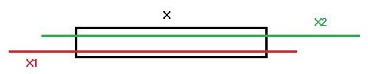

# Определение длины соединения (топология)

Длина маршрутизируемого соединения определяется из следующих компонентов:

* Сумма длины пересекаемых сегментов и точек маршрутизации (эти длины могут быть введены вручную или определятся автоматически)
* Длина до вывода источника и цели: Длины из схемы соединений (позиция X, Y и Z и дополнительная длина) + дополнительная длина до вывода на исходной и целевой функции
* Общая дополнительная длина (половина прибавляется к автоматически определенной длине и по 1/4 прибавляется к длинам до выводов источника и цели).

### Определение длины до вывода источника и цели

Длина до вывода отдельного соединения состоит из длины, которая была определена из схемы соединений для соответствующего вывода устройства и дополнительной длины до вывода на исходной и целевой функции.

При определении длины из ***Схемы соединений*** для каждого вывода устройства суммируются значения из полей Позиция X, Позиция Y и Позиция Z (это соответствует прямоугольной разводке). К полученному результату прибавляется значение из поля Доп. длина или — если оно равно 0 — значение свойства Дополнительная длина (стандарт) изделия. При локальной схеме соединений свойство Дополнительная длина (стандарт) не учитывается.

***Допонительная длина до вывода*** записывается на исходной и целевой функциях в свойство Топология: Допонительная длина до вывода. Здесь можно, например, задать длину от последней точки маршрутизации до функционального элемента.

### Маршрутизация кабелей

Соединения кабеля изначально маршрутизируются как отдельные соединения. После маршрутизации первого соединения кабеля автоматически маршрутизируются все остальные соединения кабеля.

Затем автоматически определяются сегменты маршрутизации, через которые проходит большинство отдельных соединений кабеля. Эта 'общая трасса' по умолчанию присваивается всем соединениям кабеля и заносится в свойство кабеля Топология: Трасса маршрутизации. После этого все соединения кабеля автоматически маршрутизируются еще раз с учетом новой настройки.

Длина кабеля складывается из длины 'общей трассы' (X) и длин до вывода источника и цели (X1 + X2).

Длина до вывода кабеля находится как сумма максимальной длины до вывода отдельных кабельных соединений (длина от последней точки 'общей трассы' до вывода устройства) и дополнительной длины до вывода на исходной и целевой функции. Длина до вывода кабельного соединения для каждого вывода устройства определяется по схеме соединений.

!!! example "Пример:"

    Определение длины до вывода у источника соединения А = Максимальная определенная длина до вывода из схемы соединений исходной функции, это же длина от входа в устройство.B = Дополнительная длина до вывода на исходной функции (длина от последней точки маршрутизации до функционального элемента).C = Длина до вывода. К этой длине до вывода прибавляется еще 1/4 общей дополнительной длины, которая определена в настройках проекта для маршрутизируемых соединений.

Кабели можно прокладывать только тогда, когда все отдельные соединения кабеля однозначно определены. Соединения определяются через свойства Цвет / номер и Парный индекс, поэтому эти свойства должны иметь разные значения.

#### Длина зачистки кабеля

Длина зачистки определяется из схемы соединений. Для каждого вывода устройства суммируются значения из полей Позиция X, Позиция Y и Позиция Z (что соответствует прямоугольной разводке). К полученному результату прибавляется значение из поля Доп. длина или — если оно равно 0 — значение свойства Дополнительная длина (стандарт) изделия. При локальной схеме соединений свойство Дополнительная длина (стандарт) не учитывается.

Самое большое из найденных значений записывается в свойствах кабеля Кабель / Группа соединений: Длина зачистки источника и Кабель / Группа соединений: Длина зачистки цели.

**См. также:**

* [Сети соединенных сегментов (топология)](cablinggui_k_start.md)
