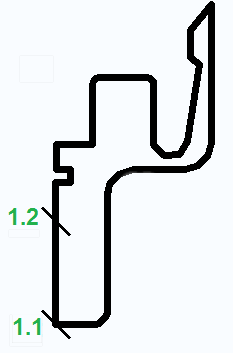
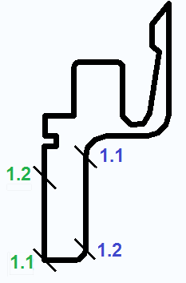

# Определить соединительные отверстия для проводов на гребенках для проводов

Платформа EPLAN позволяет при вставке гребенок для проводов в пространство листа автоматически размещать с ними соединительное отверстие для проводов. Для этого нужно предварительно определить две монтажные поверхности на контуре гребенки для проводов. Монтажные поверхности указываются путем попарного размещения точек определения контура типа "Гребенка для проводов, передняя сторона" и "Гребенка для проводов, задняя сторона" на контуре.

Условия:

* Вы открыли проект.
* В основных данных задан контур выдавливания для гребенки для проводов типа *.fc2.

1. Выберите следующие пункты меню: Сервисные программы > Основные данные > Контур (выдавливание) > Открыть
2. Выберите в следующем диалоговом окне контур гребенки для проводов.

!!! info "Для сведения:"

    Контур открывается в редакторе контура.

3. Выберите пункты меню Вставить > Логика > Гребенка для проводов, передняя сторона.

!!! info "Для сведения:"

    В редакторе контура появится точка определения контура "Гребенка для проводов, передняя сторона 1.1".

4. Щелчком мышки разместите точку определения контура на передней стороне контура и установите таким образом начальную точку монтажной поверхности.

5. Разместите с необходимым интервалом от только что добавленной точки определения контура следующую точку определения контура "Гребенка для проводов, передняя сторона 1.2" и установите таким образом конечную точку монтажной поверхности на передней стороне.

6. Повторите действия для определения монтажной поверхности на задней стороне гребенки для проводов при помощи пунктов меню Вставить > Логика > Гребенка для проводов, задняя сторона.

!!! note "Замечание:"

    Точки определения контура для монтажных поверхностей должны размещаться по часовой стрелке на контуре гребенки для проводов.

7. Закройте редактор контура.
8. Укажите в базе данных изделий на изделии гребенки для проводов контур, обработанный таким образом, в поле Макрос вкладки Технические данные.
9. Разместите гребенку для проводов при помощи пунктов меню Вставить > Пользовательская шина в пространстве листа, например на шине системы направляющих для проводов, и растяните гребенку для проводов до нужной длины.

!!! info "Для сведения:"

    Вместе с гребенкой для проводов автоматически размещается соединительное отверстие для проводов, определенное в редакторе контура.

!!! example "Пример:"

    Гребенка для проводов (выделена голубым) с автоматически сгенерированным соединительным отверстием для проводов (выделено коричневым)

**См. также:**

* [Редактор контура: Логические элементы](contoureditorgui_k_logikelemente.md)
* [Маршрутизируемые соединения в системе направляющих для проводов](routinggui_k_verdrahtungssystem.md)
