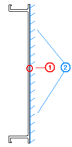
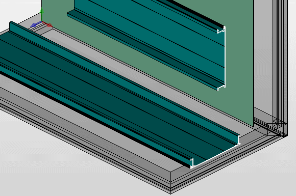

# Редактор контура: Нулевая точка контура

Контуры типа ***Выдавить контур*** образуют основную форму определяемой пользователем шины. Для размещения шины важно, на каком месте контура находится нулевая точка, и какое положение занимает контур. В зависимости от положения нулевой точки в контуре на определяемой пользователем шине генерируется поверхность установки, которая связана с монтажными поверхностями компонента, на котором должна быть размещена шина.

(1) Нулевая точка; здесь находится точка захвата при размещении шины
(2) Предполагаемая поверхность установки; эта поверхность при размещении шины накладывается на поверхность монтажа.

Шину, основывающуюся на контуре с отмеченным положением нулевой точки, можно разместить, например, на монтажной поверхности вертикально или горизонтально.

**См. также:**

* [Редактор контура: Логические элементы](contoureditorgui_k_logikelemente.md)
* [Создание контуров](contoureditorgui_h_konturenerzeugen.md)
* [Обработать свойства точек определения контуров](contoureditorgui_h_konturdefseigenschaftenbearbeiten.md)
* [Генерирование и обработка записей данных контура ЧУ](contoureditorgui_h_nckonturdatenbearbeiten.md)
