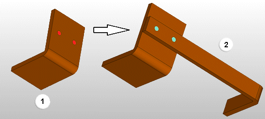
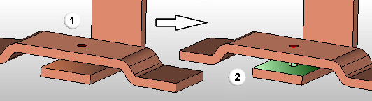

# Унаследовать схему сверления автоматически или вручную

Условие:

Вы открыли проект, который содержит медные функциональные элементы.

При оснащении медных функц. элементов можно автоматически передавать ссылки на монтажные отверстия с одного медного функц. элемента на другой. Если медный функциональный элемент размещается на монтажной поверхности другого и в области перекрытия находится монтажное отверстие, то для монтажного отверстия автоматически производится ссылка на новый размещенный медный функциональный элемент. Эта привязка учитывается при отображении сверлений и в экспортах. После разделения обоих медных функциональных элементов методом удаления или перемещения привязанная схема сверления не сохраняется.

Действует условие, что функц. элементы нужно размещать параллельно друг над другом и что монтажные отверстия должны полностью лежать на монтажной поверхности целевого функц. элемента.

Перед размещением медный функциональный элементов активируйте настройку Автоматически несколько монтажных отверстий. При этом для всех размещений изделий включается свойство Допускается несколько монтажных отверстий.

1. Выберите пункты меню Параметры > Настройки > Пользователь > Графическая обработка > Изгиб шины.
2. Установите флажок Автоматически несколько монтажных отверстий и щелкните ++ОК++.
3. Разместите монтажные отверстия на медном функциональном элементе.
4. Разместите второй медный функциональный элемент на монтажной поверхности первого функц. элемента, где расположены отверстия. Следите за тем, чтобы отверстия полностью перекрывались монтажной поверхностью второго медного функционального элемента.

!!! info "Для сведения:"

    Отверстия переносятся на второй медный функциональный элемент и там же отображаются.

Кроме автоматического унаследования монтажных отверстий существует возможность последующего переноса монтажных отверстий с одного функц. элемента-шины на другой, уже размещенный. Здесь также действует условие, что функц. элементы нужно размещать параллельно друг над другом и что монтажные отверстия должны полностью лежать на монтажной поверхности целевого функц. элемента.

1. Выберите пункты меню Обработать > Графика > Унаследовать схему сверления.
2. Щелчком мыши выберите функц. элемент - источник, с которого вы хотите перенести схему сверления. При этом выбирать можно исключительно медные функциональные элементы.
3. Выберите монтажную поверхность функц. элемента, на которую вы хотите перенести схему сверления.

!!! info "Для сведения:"

    Монтажные поверхности функц. элемента - цели при соприкосновении с курсором выделяются цветом. На них отображаются точки захвата и система координат.

4. Щелчком мыши выберите нужную монтажную поверхность.

!!! info "Для сведения:"

    Расположение схемы сверления функц. элемента - источника (1) переносится на функц. элемент -цель (2).

!!! info "Для сведения:"

    Выбор целевого функционального элемента остается активным, и вы можете щелчком мыши выбрать другие монтажные поверхности, чтобы перенести туда схему сверления.

На унаследование монтажных отверствии влияют разные действия, которые изменяют медные функц. элементы. Изменение медных функц. элементов может привести к тому, что унаследованные монтажные отверствия не будут отображаться правильно. Если активирована пользовательская настройка Графическая обработка > Изгиб шины > Автоматическое обновление многократных пробоев, то обновление производится после каждого изменения монтажных отверстий автоматически.

Однако можно обновить унаследование во всем пространстве листа и вручную.

1. Выберите пункты меню Обработать > Графика > Обновление многократных пробоев.

!!! info "Для сведения:"

    В актуальном пространстве листа будут заново рассчитаны все унаследования монтажных отверстий. Выполняется обновление отображения.

**См. также:**

* [Диалоговое окно Настройки: Изгиб шины (пользователь)](cabinetgui_d_einstellungenkupferbiegungbenutzer.md)
