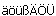

# Синтаксическая проверка ОУ

Устройство содержит обычно всю идентифицируемую информацию (такую как: установка, место установки, буквенное обозначение) в своем обозначении. Чтобы проверить введенные для ОУ данные на длину и допустимые символы, Вы можете использовать проверку обозначений.

Проверка осуществляется также при вводе обозначений в рамках Управление структ. идентификаторами. Допустимые символы Вы можете задать в настройках синтаксиса ОУ. Следующие символы по умолчанию не разрешены , за исключением случаев, если они указаны в настройках как допустимые текстовые спецсимволы.

Проверка обозначений дает Вам следующие возможности:

* При необходимости Вы можете отключить проверку.
* Вы можете определить различные настройки и допустимые спецсимволы для проверки блоков идентификаторов, обозначений устройств и счетных номеров.
* EPLAN также позволяет игнорировать недопустимый символ при синтаксической проверке.

**См. также:**

* [Проверить обозначение устройства](devicetagcheckgui_h_bmueberpruefen.md)
* [Диалоговое окно Настройки: Синтаксическая проверка ОУ](devicetagcheckgui_d_einstellungenprojektbmsyntaxueberpruefung.md)
* [Диалоговое окно Синтаксическая проверка ОУ](devicetagcheckgui_d_syntaxfehlermeldung.md)
