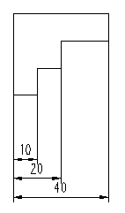

# Вставить указание размеров исходной линии

Пока активировано указание размеров исходной линии, всегда исходная точка рассматривается как начальная точка измерения следующей линии измерения. Следующая начерченная точка является при этом новой конечной точкой измерения.

Числовая мера при указании размеров исходной линии всегда рассчитывается от начальной точки до конечной точки соответствующего фрагмента. Линии с размерами — в отличие от инкрементального указания размеров — чертятся на разных высотах, а числовые меры размещаются на фрагментах по центру.

1. Вставить > Указание размеров > Указание размеров исходной линии
2. Укажите начальную точку измерения, щелкнув левой клавишей мыши.
3. Укажите первую конечную точку измерения.
4. Укажите интервал указания размеров для объекта, к которому указываются размеры. Для этого переместите мышь в вертикальном направлении к линии с размерами, пока не будет достигнут требуемый интервал, после чего щелкните левой клавишей мыши.

!!! info "Для сведения:"

    Выносные линии чертятся с соблюдением соответствующей высоты.

5. Укажите следующую конечную точку измерения. Она может находиться внутри или за пределами определенного вначале размера.

!!! info "Для сведения:"

    Чертится линия с размерами, а числовая мера размещается на фрагменте по центру. Высота, на которой чертятся следующие линии с размерами, определяется стандартом DIN.

6. Укажите другие конечные точки измерения.
7. Завершите операцию, выбрав пункт всплывающего меню Прервать операцию или нажав клавишу ++Esc++.

**См. также:**

* [Указания размеров](dimensiongui_k_start.md)
* [Указания размеров: Принцип](dimensiongui_k_bemassungenprinzip.md)
