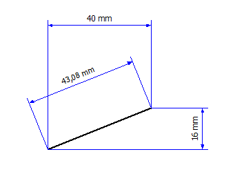

# Вставить отдельное указание размеров / произвольное указание размеров

Отдельное указание размеров можно чертить только по горизонтали или по вертикали. Зато произвольное указание размеров можно чертить под любым нужным углом, т.е. линия с размерами идет параллельно по отношению к начальной и конечной точкам измерения.

1. Вставить > Указание размеров > Отдельное указание размеров
Вставить > Указание размеров > Произвольное указание размеров
2. Укажите начальную точку измерения, щелкнув левой клавишей мыши.
3. Укажите конечную точку измерения.

!!! tip "Совет:"

    Если при вводе двух точек измерения удерживать нажатой клавишу ++Ctrl++, будет определена середина между точками. Далее в этой расчетной середине устанавливается начальная точка измерения. После этого введите конечную точку измерений, не нажимая клавишу ++Ctrl++. Этот способ ввода возможен также при добавлении указания размеров в обзоре модели.

1. Укажите интервал указания размеров для объекта, к которому указываются размеры. Для этого переместите мышь в вертикальном направлении к линии с размерами, пока не будет достигнут требуемый интервал, после чего щелкните левой клавишей мыши.

!!! info "Для сведения:"

    Выносные линии чертятся с соблюдением соответствующей высоты.

!!! info "Для сведения:"

    По умолчанию числовая мера выравнивается на линии с размерами по центру.

2. Завершите операцию, выбрав пункт всплывающего меню Прервать операцию или нажав клавишу ++Esc++.

**См. также:**

* [Указания размеров](dimensiongui_k_start.md)
* [Указания размеров: Принцип](dimensiongui_k_bemassungenprinzip.md)
