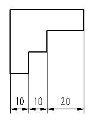

# Вставить непрерывное указание размеров

Пока активировано непрерывное указание размеров, последняя конечная точка измерения всегда интерпретируется как начальная точка измерения следующей линии с размерами. Следующая начерченная точка является при этом новой конечной точкой измерения.

Размеры каждого фрагмента определяются отдельно, т.е., числовая мера при непрерывном указании размеров относится только к соответствующему фрагменту.

1. Вставить > Указание размеров > Непрерывное указание размеров
2. Укажите начальную точку измерения, щелкнув левой клавишей мыши.
3. Укажите первую конечную точку измерения.
4. Укажите интервал указания размеров для объекта, к которому указываются размеры. Для этого переместите мышь в вертикальном направлении к линии с размерами, пока не будет достигнут требуемый интервал, после чего щелкните левой клавишей мыши.

!!! info "Для сведения:"

    Выносные линии чертятся с соблюдением соответствующей высоты.

5. Укажите следующую конечную точку измерения.

!!! info "Для сведения:"

    Линия с размерами чертится на высоте и направлении предыдущей линии с размерами, а числовая мера размещается на фрагменте по центру.

6. Укажите другие конечные точки измерения.
7. Завершите операцию, выбрав пункт всплывающего меню Прервать операцию или нажав клавишу ++Esc++.

**См. также:**

* [Указания размеров](dimensiongui_k_start.md)
* [Указания размеров: Принцип](dimensiongui_k_bemassungenprinzip.md)
