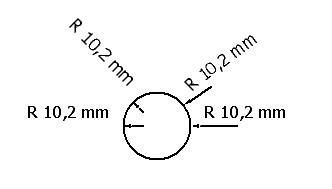

# Вставить круговое указание размеров

Чтобы определить размер радиуса круга, сначала выделите круг, а затем укажите позицию линии с размерами (и числовой меры). Числовая мера может быть записана на круг в любом нужном Вам углу. Независимо от позиции конечной точки числовой мерой всегда является радиус круга.

1. Вставить > Указание размеров > Круговое указание размеров
2. Выделите круг.

!!! info "Для сведения:"

    Центр круга автоматически выбирается в качестве начальной точки измерения.

3. Укажите конечную точку линии с размерами и щелкните левой клавишей мыши.

!!! info "Для сведения:"

    Если конечная точка находится в границах круга, то в качестве линии с размерами выступает маленькая стрелка, которая наносится на внутреннюю границу круга. Если конечная точка находится вне круга, то линия с размерами чертится от конечной точки до внешней границы круга.

!!! note "Замечание:"

    аналогичным образом указываются размеры и на дугах окружности.

**См. также:**

* [Указания размеров](dimensiongui_k_start.md)
* [Указания размеров: Принцип](dimensiongui_k_bemassungenprinzip.md)
