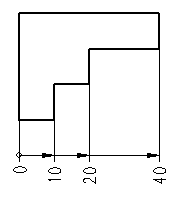

# Вставить инкрементальное указание размеров

Пока активировано инкрементальное указание размеров, последняя конечная точка измерения всегда интерпретируется как начальная точка измерения следующей линии с размерами. Следующая начерченная точка является при этом новой конечной точкой измерения.

Числовая мера при инкрементальном указании размеров всегда рассчитывается от начальной точки до конечной точки соответствующего фрагмента. Все линии с размерами чертятся на одной высоте.

При инкрементальном указании размеров Вы можете указать сначала общий размер, а затем - частичные размеры. Но возможно также увеличивать общий размер так, как Вам нужно.

1. Вставить > Указание размеров > Инкрементальное указание размеров
2. Укажите начальную точку измерения, щелкнув левой клавишей мыши.
3. Укажите первую конечную точку измерения.
4. Укажите интервал указания размеров для объекта, к которому указываются размеры. Для этого переместите мышь в вертикальном направлении к линии с размерами, пока не будет достигнут требуемый интервал, после чего щелкните левой клавишей мыши.

!!! info "Для сведения:"

    Выносные линии чертятся с соблюдением соответствующей высоты.

5. Укажите следующую конечную точку измерения. Она может находиться внутри или за пределами определенного вначале размера.

!!! info "Для сведения:"

    Линия с размерами чертится на высоте и в направлении предыдущей линии с размерами, а числовая мера размещается в конце фрагмента.

6. Укажите другие конечные точки измерения.
7. Завершите операцию, выбрав пункт всплывающего меню Прервать операцию или нажав клавишу ++Esc++.

!!! tip "Совет:"

    В настройке проекта можно указать, чтобы для инкрементального указания размеров отображалось начальное значение. Для этого выберите пункты меню Параметры > Настройки > Проекты > "Имя проекта" > Графическая обработка > Указание размеров и установите флажок Отобразить начальное значение при инкрементальном указании размеров. Эта настройка также влияет на уже имеющиеся инкрементальные указания размеров.

**См. также:**

* [Указания размеров](dimensiongui_k_start.md)
* [Указания размеров: Принцип](dimensiongui_k_bemassungenprinzip.md)
