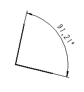

# Вставить угловое указание размеров

Чтобы определить размер для угла, укажите сначала центр угла, а затем начальную и конечную точки. С помощью начальной точки определяется расстояние линии с размерами от центра угла.

1. Вставить > Указание размеров > Угловое указание размеров
2. Укажите центр угла, щелкнув левой клавишей мыши.
3. Укажите начальную точку угла.

!!! info "Для сведения:"

    Расстояние от начальной точки к центру угла составляет в итоге высоту линии с размерами.

4. Разверните угол против часовой стрелки и укажите конечную точку.

!!! info "Для сведения:"

    По умолчанию числовая мера выравнивается на линии с размерами по центру.

5. Завершите операцию, выбрав пункт всплывающего меню Прервать операцию или нажав клавишу ++Esc++.

**См. также:**

* [Указания размеров](dimensiongui_k_start.md)
* [Указания размеров: Принцип](dimensiongui_k_bemassungenprinzip.md)
