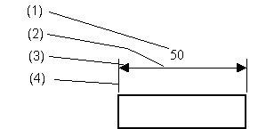
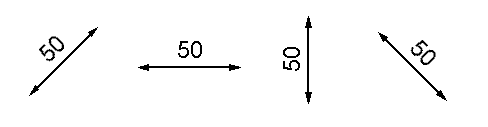
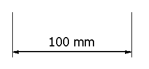
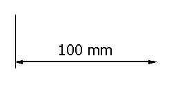

# Указания размеров: Принцип

Размер состоит из различных элементов:

(1) Числовая мера

(2) Линии с размерами

(3) Ограничения линий с размерами

(4) Выносные линии.

Толщина и цвет линий с размерами и выносных линий задаются через используемый слой. При этом стандартный слой указания размеров в EPLAN107 ("Графика.Указание размеров") задает толщину линии 0,25 мм и "синий" цвет. Чтобы задать собственные значения для толщины и / или цвета линий указания размеров, используйте другой слой. Цвет размерного числа задается, тем не менее, в самом указании размеров (диалоговое окно свойств, вкладка Формат).

### Размерное число

Числовая мера, как правило, чертится по центру на линии с размером шрифта 3,5 мм, но она зависит от типа указания размеров. Позже вы можете смещать числовую меру так, как Вам нужно. Числовую меру можно изменять позже, что позволяет определять размеры и для немасштабных длин.

Кроме того, можно указать префикс и суффикс, напр., "Диаметр 10 мм". Число десятичных разрядов можно настраивать, причем можно не показывать нули.

Можно настраивать единицы отдельно для каждого размера. Например, если стандартная единица — это "мм", то все равно может оказаться целесообразным указание других единиц для некоторых размеров.

### Ограничение линии с размерами

Ограничения линий с размерами по умолчанию отображаются размерными стрелками, но возможны также другие обозначения, напр., разомкнутый круг. Затем может случиться так, что из соображений площади одно или оба ограничения линий с размерами могут быть отклонены.

Для указания размеров у дуги допускается только размерная стрелка.

Размерные стрелки можно по отдельности включать и выключать для левой и для правой стороны.

### Линия с размерами

Линии с размерами вводятся как тонкие границы объектов вне заготовки и при этом протягиваются между двумя выносными линиями.

Если указан размер, то последующие размеры (непрерывный размер или указание размеров исходной линии) должны выровняться согласно этой размерной цепи.

Числовая мера отображается через линию с размерами и читается снизу и справа (в зависимости от положения основной надписи).

Линии с размерами имеют толщину 0,25 мм.

### Выносные линии

Выносные линии параллельны друг другу, в большинстве случаев они перпендикулярны по отношению к линии с размерами и выходят на 2 мм за линию с размерами. Выносные линии имеют толщину 0,25 мм.

В особых случаях выносные линии могут быть скрыты.

**См. также:**

* [Указания размеров](dimensiongui_k_start.md)
* [Диалоговое окно Настройки: Указание размеров](dimensiongui_d_projektbemassung.md)
* [Вкладка Указания размеров](dimensiongui_r_bemassung.md)
