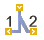
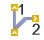
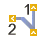
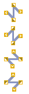
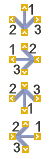

# Символы соединения: Отображение направления соединений

При отображении точек соединения символов соединения необходимо учитывать следующие особенности:

Тройники служат для разветвления автоматически сгенерированных линий соединения. Существуют тройники для четырех различных направлений. Для каждого направления имеется также четыре варианта. Эти варианты определяют прохождение соединений.

Каждый тройник снабжен тремя выводами устройства. Точка без обозначения указывает, откуда идет соединение. Точки, обозначенные "1" и "2" задают последовательность целей.

В диалоговом окне Тройник <Направление> первую цель обозначают при помощи прямой линии, а вторую цель — при помощи косой линии.

 |  Тройник внизу
---|---
 |  Тройник вверху
 |  Тройник справа
 |  Тройник слева

!!! example "Пример:"

    Выборнастройки Тройник справа(третий вариант) означает:Если идти сверху (1) или снизу (2), то тогда цель находится справа.Если идти справа, то первая цель находится вверху (1), а вторая — внизу (2 / косая линия).

Перекрестные соединения представляют собой два связанных друг с другом тройника. В EPLAN существует два основных типа перекрестных соединений, которые отличаются друг от друга направлениями поиска "Вертикально" и "Горизонтально". Для каждого направления поиска имеется два варианта, что обусловлено различными целями. При помощи этих вариантов однозначно задаются пути для отслеживания цели при отчетах.

В каждом перекрестном соединении имеется по три направления соединений. Это соответственно два находящихся друг напротив друга, непосредственно связанные конца (прямые линии), которые ведут к первой цели. Два других конца (косые линии) ведут соответственно к первой цели.

!!! example "Пример:"

    Для второго варианта Вертикальноэто означает:Сверху первая цель находится внизу и вторая цель слева (косая линия).Справа цель находится внизу. (На изображениях в этих двух случаях целью является катушка.)Снизу первая цель находится наверху и вторая цель справа (косая линия).Слева цель находится наверху. (На изображениях в этих двух случаях целью является замыкающий контакт.)

Перемычки используются, чтобы электрически соединить клемму с одной или несколькими соседними клеммами (Распределение потенциала). В электротехнике для этого применяются металлические перемычки или мостовые перемычки.

В каждой перемычке имеется по три направления соединений. Для этого каждая перемычка оснащена четырьмя выводами устройства. Точки, обозначенные "1", "2" и "3" задают последовательность целей. Четвертая точка (без обозначения) представляет общую точку соединения перемычки. Первая цель всегда находится напротив. Вторая цель всегда находится под прямым углом слева или сверху. Вторая цель всегда находится под прямым углом справа или снизу.

!!! example "Пример:"

    Для второго варианта Вверхуэто означает:Смотря сверху, первая цель находится внизу, вторая цель слева и третья находится справа.Смотря слева, справа и снизу цель находится соответственно сверху.

**См. также:**

* [Символы соединения](egedgui_k_start.md)
