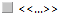

# Диалоговое окно Конфигурировать порядки свойств — <Имя проекта>

Вы открыли проект. Данные проекта > Конфигурировать порядки свойств.

В этом диалоговом окне создаются определенные пользователем порядки свойств. Эти порядки сохраняются как специфические для проекта и могут использоваться на 3D-размещениях изделий и условных обозначениях внутри проекта.

Обзор основных элементов диалогового окна:

В левой части диалогового окна определенные пользователем порядки свойств, имеющиеся в текущем проекте, отображаются в представлении в виде дерева и представлении в виде списка.

Благодаря использованию шаблонов проекта порядки свойств для 3D-размещения изделий уже доступны в новом проекте. Для условных обозначений порядки свойств отображаются, только если здесь в диалоговом окне или на самом условном обозначении сохранен определенный пользователем порядок свойств под именем.

Пока определенные пользователем порядки свойств 3D-размещения изделий в пространстве листа присвоены определению функции, порядки свойств для условного обозначения сохраняются для варианта символа.

### Фильтр

Введите в это поле текст, по которому должна выполняться фильтрация порядков свойств. При этом поиск порядков свойств выполняется как по идентифицирующему, так и по отображаемому имени.

Если необходимо вернуться к прежнему виду порядков свойств, удалите текст из поля ввода. Для этого нажмите кнопку {: .ui-icon } (Удалить).

### Всплывающее меню

Всплывающее меню дает доступ, в зависимости от типа поля (например, дата, целое число, многоязычный), к пунктам меню, при помощи которых вы можете по необходимости, например, влиять на представление таблиц или обрабатывать значения в полях. Обзор пунктов этого всплывающего меню вы можете найти в разделе [Пункты всплывающего меню](userinterface_m_kontextmenu.md).

Дополнительно здесь представлены следующие пункты всплывающего меню, специфические для данного диалогового окна:

Пункт меню |  Значение
---|---
С ориентацией на библиотеку (только дерево) |  Доступно только в порядках свойств для условных обозначений. Отображает библиотеки символов в самом верхнем узле дерева в папке "Условное обозначение". Ниже находятся определения функций.
С ориентацией на функцию (только дерево) |  Доступно только в порядках свойств для условных обозначений. Отображает функциональную категорию (например, "Катушки и контакты", "Сигнальные устройства" и т. д.) в самом верхнем узле дерева в папке "Условное обозначение".
Создать |  Позволяет создавать новый определенный пользователем порядок свойств. В зависимости от выделения в дереве или списке сначала открывается диалоговое окно Определения функций или Выбор символа, а после выбора определения функции или символа — диалоговое окно Новый порядок свойств.
Вставить в список результатов поиска |  Проверяет использование выделенных порядков свойств в проекте и вносит найденные объекты в список результатов поиска. Благодаря этому с помощью пункта всплывающего меню Перейти к (графика) можно найти используемые порядки свойств объектов, например условные обозначения, размещения изделий и т. д., в графике.

* * *

Новый порядок свойств

При создании новых порядков свойств выделенный уровень иерархии используется в качестве фильтра.

Если выбран вариант символа или порядок свойств варианта символа, открывается диалоговое окно Новый порядок свойств для ввода идентифицирующего имени, а затем создается порядок свойств для условного обозначения. Если выбрано определение функции или порядок свойств определения функции, создается порядок свойств для определения функции.

Если в дереве выбран более высокий уровень иерархии, выделенный контур используется как фильтр для диалогового окна Определения функций или Выбор символа, которое открывается далее. Затем в диалоговом окне Новый порядок свойств введите однозначное идентифицирующее имя порядка свойств.

!!! note "Замечание:"

    Идентифицирующее имя должно быть однозначным в пределах одного проекта и не может быть изменено в дальнейшем.

Многократный выбор порядков свойств

Многократный выбор порядков свойств доступен в дереве или списке. При этом необходимо учитывать следующее:

* Если выбраны порядки свойств разных вариантов символа или определений функции, для этих порядков свойств можно задать общее отображаемое имя.
* При ***одинаковой конфигурации*** (одинаковые свойства, последовательность свойств и настроек присоединения) порядки свойств можно непосредственно обрабатывать на вкладках Трехмерные функции, Условное обозначение и т. д.
* При ***разных конфигурациях*** на вкладках Трехмерные функции, Условное обозначение и т. д. отображается запись . Чтобы все равно конфигурировать эти порядки свойств совместно, выделите эту запись, а затем удалите все ранее выбранные свойства с помощью кнопки {: .ui-icon } (Удалить). В результате все выбранные порядки свойств получают совершенно новую конфигурацию!

После совместной обработки выбранные размещения свойств и измененные настройки отображения доступны на всех выбранных порядках свойств.

* * *

### Идентифицирующее имя

Здесь отображается однозначное имя, заданное при создании порядка свойств. Под этим именем порядком свойств можно управлять в EPLAN.

### Отображаемое имя

Здесь вводится имя, под которым порядок свойств будет отображаться в проекте. Возможен многоязычный ввод.

### Стандарт

Установите этот флажок, если порядок свойств следует применять по умолчанию во всех других случаях использования 3D-размещения изделия / варианта символа.

* * *

Конфигурация свойств и настроек отображения

Сама конфигурация свойств с соответствующими настройками отображения выполняется для 3D-размещений изделий на вкладке Трехмерные функции, а для условных обозначений — на вкладке Условное обозначение, а также на вкладках Выводы устройства и Образ контакта. При этом доступны такие же возможности настройки, как и на вкладке [Отображение](devicetaggui_r_anzeige.md) диалогового окна 'Свойства'.

### [Дополнительно]

Пункт меню |  Значение
---|---
Проверить использование |  В представлении в виде списка заполняет столбец Количество использований текущими числами, отображающими частоту использования соответствующего порядка свойств в проекте. Неиспользованные порядки свойств получают запись "0".
Убрать неиспользуемые порядки свойств
|  Удаляет определенный пользователем порядок свойств, не используемый в проекте. Четко заданные порядки свойств (например, "Станд. указание" или "Вверху слева, снаружи, 90°" в случае с блоками) не убираются.

**См. также:**

* [Использовать определенный пользователем порядок свойств](devicetaggui_h_eigschanordnungen.md)
* [Графический редактор](gededitgui_k_start.md)
