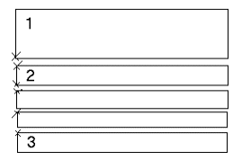
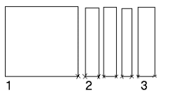

# Динамическое размещение графики

Чтобы создать верхний колонтитул, область данных и нижний колонтитул в пределах страницы, используется концепция динамических форм. Т.к. позиции этих областей динамичны и хорошо выделяемы в графике таблицы, то строка в динамичной форме, созданная в отчете, способна сама чертить рамку.

Обычно верхний колонтитул, область данных и нижний колонтитул используется только для форм, из которых создаются относящиеся к функции отчеты, к примеру спецификации клеммников. Для обзоров, таких, как, например, спецификации изделий, верхний колонтитул несущественен.

!!! note "Замечание:"

    Динамические формы вы отличите по тому, что для свойства формы Работа с формой была выбрана запись "Динамич." из раскрывающегося списка.

!!! example "Пример:"

    Список обозначений устройств должен быть сгенерирован со следующими динамическими областями:Список обозначений устройств (Строка верхн. колонт. страницы)ОУ/Колич./Обозначение Производитель: H1 (Строка верхн. колонт. группы)K1 / 10 / Обозначение 1K2 / 5 / Обозначение 2Kn / 99 / Обозначение nПроизводитель: H2 (Строка верхн. колонт. группы)K1 / 10 / Обозначение 1K2 / 5 / Обозначение 2Kn / 99 / Обозначение n

Эта информация отмечается в редакторе формы как рамка строки и с каждой созданной строкой записывается в страницу отчетов. Кроме того, возможно также определять текстовые и графические объекты как верхний колонтитул, элементы данных и нижний колонтитул, а не только тексты-заполнители.

Условия:

* Вы открыли проект.
* Вы открыли в редакторе форм динамическую форму, которую хотите обработать (Сервисные программы > Основные данные > Форма > Открыть > [Открыть]).

1. Вставить > Динамическую область
2. Выберите из следующего меню через параметры Верхний колонтитул, Заголовок (для области данных), Область данных, Нижний колонтитул области данных или Нижний колонтитул, какую область вы хотите определить.

!!! info "Для сведения:"

    Прямоугольник, который отображает область, появится рядом с курсором.

3. Щелкните мышкой, чтобы разместить начальный угол в прямоугольнике, который нужно начертить.
4. Щелкните, чтобы установить конечную позицию прямоугольника.

!!! info "Для сведения:"

    Чертится прямоугольник, отображающий ту или иную область; дополнительно слева вверху выводится информация, о каком типе области идет речь (верхний колонтитул, область данных и нижний колонтитул, нижн. колонтитул области данных или заголовок).

5. Выделите заново определенный прямоугольник.
6. Выберите Вставить > текст-заполнитель.
7. В диалоговом окне Свойства (текст заполнитель) щелкните кнопку ++...++ в поле Свойство вкладки Размещение.
8. Выберите в диалоговом окне Тексты заполнителей <Тип формы> свойство, которое Вы хотите установить в качестве заполнителя для той или иной области.
9. Щелкните по кнопке ++OK++.
10. Подтвердите ввод.

!!! tip "Совет:"

    В качестве альтернативного варианта вы можете обработать также тексты-заполнители, присвоенные области, для чего необходимо дважды щелкнуть мышкой по графике динамической области. В открывшемся диалоговом окне Динамическая область на вкладке [Текст-заполнитель](formeditorgui_r_platzhaltertexte.md) перечисляются все тексты-заполнители в виде наглядной таблицы.

Свойство Выравнивание формы задает, в какой последовательности объединяются различные области определения. Если направление формы по строкам, то области определения составляются "снизу слева" по направлению "вверх налево":

Если направление формы по столбцам, то области определения составляются"снизу справа" по направлению "вниз налево":

(На обоих изображениях обозначают:
1 = верхний колонтитул
2 = область данных
3 = нижний колонтитул)

!!! note "Замечание:"

    * В случае, если размещены несколько одинаковых областей определений (например несколько областей данных), для отчетов учитывается только одна.
    * В качестве оптической контрольной функции для динамических форм выступают функции выделения (Обработать > Выделить), которые показывают соответственно все элементы верхнего колонтитула, нижнего колонтитула, нижн. колонтитула области данных или области данных или заголовка. В принципе, это обычное выделение, все выделенные элементы могут быть удалены, скопированы, перемещены и т. д.
    * Как и все другие формы, во время обработки могут быть автоматически проверены также и динамические формы (Сервисные программы > Проверить форму), например, правильно ли применяются области определения.

### Присваиваются тексты заполнителя, находящиеся за пределом области

Кроме того, для динамических форм также возможно присоединить к областям тексты заполнителя, которые расположены вне областей.

Условия:

* Вы открыли проект.
* Вы открыли в редакторе форм динамическую форму, которую хотите обработать (Сервисные программы > Основные данные > Форма > Открыть > [Открыть]).
* При помощи Вставить > Динамическая область > ++...++ Вы определили область и вставили тексты заполнителя.

1. Выделите тексты заполнителя, которые должны относиться к области.
2. Щелкните по требуемой области и затем выберите пункты меню Всплывающее меню > Присвоить объекты области.

!!! info "Для сведения:"

    Объекты присваиваются области. Присвоение можно проверить, выбрав для соответствующей области пункт всплывающего меню Выделить соответствующие объекты.

**См. также:**

* [Вставить и обработать тексты заполнители](formeditorgui_h_platzhaltertexteeinfuegen.md)
* [Проверить формы](formeditorgui_h_formularepruefen.md)
