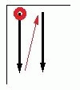
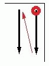
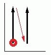
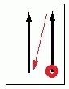
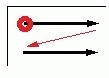
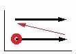
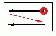
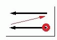

# Направление создания отчета форм

Направление создания отчета форм задается через свойство Выравнивание формы. Это свойство определяет порядок, в котором форма заполняется при отчете, — по строкам или по столбцам. 'По строкам' означает, что сначала заполняются все ячейки одной строки, а затем уже начинает заполняться следующая. 'По столбцам' означает, что сначала заполняются все ячейки одного столбца, а затем уже начинает заполняться следующий.

Кроме того, для направления создания отчета релевантны свойства Ширина столбца и Высота строки. Путем ввода положительных или отрицательных значений указывается, выполняется отчет слева направо, сверху вниз или в обратном направлении.

### Отчет по строкам

В таблицах запись '+' означает положительную величину, а запись '-' отрицательную.

#### Отчет сверху вниз и слева направо

Свойство |  Значение |  
---|---|---
Выравнивание формы |  По строкам
Ширина столбца |  +
Высота строки |  +

#### Отчет сверху вниз и справа налево

Свойство |  Значение |  
---|---|---
Выравнивание формы |  По строкам
Ширина столбца |  -
Высота строки |  +

#### Отчет снизу вверх и слева направо

Свойство |  Значение |  
---|---|---
Выравнивание формы |  По строкам
Ширина столбца |  +
Высота строки |  -

#### Отчет снизу вверх и справа налево

Свойство |  Значение |  
---|---|---
Выравнивание формы |  По строкам
Ширина столбца |  -
Высота строки |  -

### Отчет по столбцам

В таблицах запись '+' означает положительную величину, а запись '-' отрицательную.

#### Отчет слева направо и сверху вниз

Свойство |  Значение |  
---|---|---
Выравнивание формы |  По столбцам
Ширина столбца |  +
Высота строки |  -

#### Отчет слева направо и снизу вверх

Свойство |  Значение |  
---|---|---
Выравнивание формы |  По столбцам
Ширина столбца |  +
Высота строки |  +

#### Отчет справа налево и сверху вниз

Свойство |  Значение |  
---|---|---
Выравнивание формы |  По столбцам
Ширина столбца |  -
Высота строки |  -

#### Отчет справа налево и снизу вверх

Свойство |  Значение |  
---|---|---
Выравнивание формы |  По столбцам
Ширина столбца |  -
Высота строки |  +

!!! example "Пример:"

    В данном примере создается спецификация клеммника, в которой на странице отчета будет представлено несколько столбцов. Для этого отчет формы генерируется по строкам, строки заполняются сверху вниз, а столбцы следуют слева направо. Используемая форма дляспецификацииклеммника строится следующим образом:Свойство Значение Выравнивание формы По строкам Число столбцов4Число строк12Ширина столбца90.00 mmВысота строки8.00 mmПовторить верхний колонтитул нового столбцадеактивировано Генерация отчета происходит сверху вниз и слева направо. Страница отчета может содержать до четырех столбцов (на рис. они пронумерованы цифрами от 1 до 4). Сначала одна за другой заполняются строки первого столбца, затем строки второго столбца и т. д. (на рис. направление создания отчета для наглядности отмечено стрелками в красных рамках). Готовая страница отчета выглядит следующим образом:

!!! note "Замечание:"

    * При помощи свойств формы Число строк и Высота строки определите в динамических формах максимальный размер области отчета на странице: Оба значения перемножаются, и таким образом выдается значение (в "мм") для (невидимой) границы области отчета, за которой он прерывается. Линия границы рассчитывается с учетом конца верхнего колонтитула. В вышеприведенном примере это означает следующее: Если число строк = 12, а высота строки = 8 мм, отчет обрывается на высоте 12 x 8 мм = 96 мм.
    * Если свойство формы Повторить верхний колонтитул нового столбца не установлено, верхний колонтитул отображается только в первом столбце. Тогда в следующих столбцах отобразится больше строк данных, чем указано в свойстве Число строк.

**См. также:**

* [Редактор форм и рамок](formeditorgui_k_start.md)
