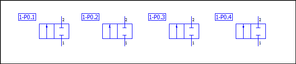
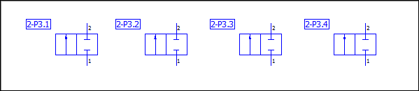

# Обработка Fluid ОУ в соответствии с DIN ISO 1219-2 в виде таблицы

EPLAN позволяет обрабатывать данные выделенных в проекте функций совместно в одном диалоговом окне. Обрабатываемые данные отображаются в табличной форме, поэтому речь пойдет о так называемой "Табличной обработке".

В следующем примере показано, как простым способом можно изменить созданные согласно DIN ISO 1219-2 обозначения устройства Fluid с помощью табличной обработки. При этом компонентам идентификатора "Номер установки" и "Номер логической ячейки" вставленных устройств за рабочий шаг должны быть присвоены новые значения.

Условия:

* Вы открыли проект.
* Проект создан с использованием шаблона FL_1219-2_tpl001. Благодаря этому шаблону проекта обозначения устройств Fluid-техники структурируются согласно стандарту DIN ISO 1219-2 по зависимым от раздела ***ключу среды***, ***номеру логической ячейки*** и ***номеру функционального элемента***.
* Создана страница типа "Схема соединений Fluid-техники" и открыта в графическом редакторе.
* На этой странице вы, к примеру, разместили четыре 2/2-ходовых клапана V11.5.1_22_02 из библиотеки символов PNE1ESS.
* Устройства Fluid обозначены в соответствии с рисунком ниже.

### Шаг 1: Определение объема обработки и открытия диалогового окна для работы в табличной форме

1. Откройте страницу схемы соединений Fluid-техники в образце проекта.
2. Выделите ходовые клапаны с 1-P0.1 по 1-P0.4.

3. Выберите следующие пункты меню: Обработать > В табличном виде.
4. В диалоговом окне Табличная обработка — <Имя проекта> переместите вкладку Функции на передний план.

### Шаг 2: Конфигурация таблиц для вывода функциональных данных

В диалоговом окне Табличная обработка — <Имя проекта> свойства выбранного устройства отображаются в форме таблицы. Отображение столбцов таблицы зависит от выбранной схемы.

После установки EPLAN Fluid доступны уже готовые схемы. По умолчанию задана схема "Все функции", покрывающая широкий спектр важных функциональных данных. Схема "Устройства Fluid" предназначена специально для обработки устройств Fluid в табличной форме.

Чтобы вы как следует познакомились с конфигурацией таблиц, эта схема должна быть заново создана в измененной форме во время второго шага и сохранена под другим именем.

1. В диалоговом окне для обработки выберите запись "Устройства Fluid" из раскрывающегося списка Схема.

!!! info "Для сведения:"

    Объединение столбцов таблицы на вкладке Функции меняется.

2. Рядом с раскрывающимся списком Схема щелкните по кнопке ++...++.
3. В диалоговом окне Настройки: Табличная обработка создайте [новую схему](schemeconfig_h_schematabearbeiten.md) с именем ОУ Fluid-техники DIN ISO 1219-2 и описанием Отображение полного ОУ согласно DIN ISO 1219-2 в отдельных столбцах.
4. В списке Конфигурация столбцов установите флажок строк Номер установки и ОУ (идентифицирующее).
5. Снимите флажки во всех строках этого списка.

!!! note "Замечание:"

    Флажок строки Состав ОУ установлен по умолчанию, и его нельзя снять.

6. Выделите в списке строку ОУ (идентифицирующее), не снимая соответствующий флажок.
7. Переместите эту строку в начало с помощью кнопок со стрелками на панели инструментов.
8. В диалоговом окне установите флажок Разделить ОУ на столбцы.

!!! info "Для сведения:"

    Если этот флажок включен, то Fluid-ОУ за исключением номера установки разносится по группе столбцов, которым вы можете назначить собственный заголовок. По умолчанию используются заголовки с "Деталь 1" по "Деталь 5". Дополнительно выводится столбец "Предв. просмотр ОУ", заголовок которого не изменяется.

9. Щелкните в списке Заголовки столбцов строку с записью "Деталь 1" и замените заголовок "Деталь 1" записью Ключ среды.
10. Повторите эту процедуру со строками "Деталь 2", "Деталь 3" и "Деталь 4". Измените записи на следующие: "Деталь 1" с номером логической ячейки, "Деталь 3" с разделителем и "Деталь 4" с номером функционального элемента.
11. Удалите строку с записью "Деталь 5".
12. Щелкните по кнопке {: .ui-icon } (Сохранить).
13. Щелкните по кнопке ++OK++.

!!! info "Для сведения:"

    Таблица конфигурируется по вновь созданной схеме "ОУ Fluid-техники DIN ISO 1219-2", в которой слева направо расположены столбцы ОУ (идентифицирующее), Номер установки, Ключ среды, Номер логической ячейки, Разделитель и Номер функционального элемента. Обозначения устройств, выделенных на схеме соединений, отображаются в соответствии с новой последовательностью столбцов.

### Шаг 3: Изменение информации в элементах ОУ

Теперь необходимо внести следующие изменения на ОУ ходовых клапанов:

* Номеру установки "1" должно соответствовать значение "2".
* Номер логической ячейки нужно изменить с "1" на "3".

1. Щелкните по ячейке в столбце Номер установки (например, для ходового клапана "1-P0.1") и перезапишите "1" на "2".
2. Скопируйте значение "2" в буфер обмена.
3. Выделите столбец Номер установки.
4. Вставьте значение "2" из буфера обмена в выделенный столбец.
5. Выполните такие же действия со столбцом Номер логической ячейки, который во всех ячейках должен принять значение "3".
6. Щелкните по схеме соединений, чтобы отобразить и сохранить это изменение.

!!! info "Для сведения:"

    Результат изменения представлен на рисунке ниже.

**См. также:**

* [Табличная обработка](functiondatagridgui_k_start.md)
* [Табличная обработка данных функций Fluid-Техники](ftechnic_k_tabellarische_bearbeitung.md)
