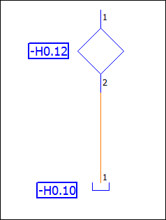
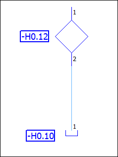

# Определить и выделить цветом трубопроводы Fluid

В технике Fluid в зависимости от области применения используются различные типы трубопроводов, например рабочие, управляющие, обратные, линии емкости, сливные и питающие линии.

В EPLAN Fluid различные типы трубопроводов представлены на схеме соединений при помощи соединений Fluid, которые в свою очередь базируются на линиях автоматического соединения. Эти линии всегда автоматически встраиваются между условными обозначениями, если их выводы устройств находятся горизонтально или вертикально по отношению друг к другу.

В EPLAN Fluid для соединения Fluid можно определить тип трубопровода, предписанный согласно стандарту DIN ISO 1219-1, с соответствующим присвоением цвета. Для этого у вас имеются соответствующие слои. Слой — это своего рода пленка, на который можно изменить графические свойства соединений линии автоматического соединения. Цветовое выделение различных типов трубопроводов служит для лучшей ориентации по схеме соединений при проведении техобслуживания, профилактических и ремонтных работ на установке Fluid-техники.

По умолчанию EPLAN Fluid присваивает всем соединениям Fluid тип трубопровода "Рабочая линия" и цвет "Оранжевый". Соответствующий слой называется EPLAN507, Символьная графика.Символы соединения.Автосоединение.Рабочая линия.

Ниже на конкретном примере описано, как при такой стандартной настройке изменить тип трубопровода у соединения Fluid-техники и в связи с этим — цвет, присвоив целям соединения Fluid-техники другие свойства выводов устройства.

Условия:

* Вы открыли проект.
* Открыта схема соединений Fluid, на которой вы разместили условное обозначение для гидравлического фильтра и возврата резервуара.
* Оба условных обозначения соединены между собой линией автоматического соединения, которая по умолчанию представлена в оранжевом цвете, как рабочая линия.

1. Щелкните двойным щелчком по условному обозначению фильтра на схеме соединений, который является первой целью соединения.
2. Переместите в диалоговом окне Свойства ++...++ фильтра вкладку Данные символа / функции на передний план и щелкните по кнопке ++Логика++.
3. В диалоговом окне Логическая схема выводов устройства на выводе устройства функции "2" измените значение для свойства Подвод давления / управляющий вывод устройства с "Не определено" на "Обратная линия".
4. Подтвердите ввод.
5. Повторите вышеописанные шаги для возврата резервуара, который является второй целью соединения. При этом измените на выводе устройства функции "1" значение "Подвод давления" также на "Обратная линия".
6. Обновите схему соединений в графическом редакторе, нажав кнопку ++F5++ (Начертить заново).

!!! info "Для сведения:"

    Поскольку на обеих целях соединения был настроен одинаковый тип трубопровода "Обратная линия", EPLAN Fluid изменяет на соединении заданный по умолчанию тип трубопровода "Рабочая линия" на "Обратная линия". При этом соединению Fluid автоматически присваивается слой EPLAN521, Символьная графика.Символы соединения.Автосоединение.Обратная линия, вследствие чего линия автоматического соединения приобретает цвет "Голубой".

**См. также:**

* [EPLAN Fluid: Соединения](ftechnic_k_verbindungen.md)
