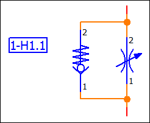

# Представление ОУ Fluid-техники на схеме соединений

Стандарт Fluid-Техники DIN ISO 1219-2 предписывает снабжать обозначения устройств на схеме соединений прямоугольной рамкой. EPLAN Fluid дает возможность вставлять и убирать подобные текстовые рамки. Для этого на вкладке Отображение в диалоговом окне Свойства ++...++ имеется свойство Начертить рамку текста. Наряду с прямоугольником в качестве рамки (хотя и не в соответствии со стандартом) также используется эллипс или овал.

!!! note "Замечание:"

    Пожалуйста, обратите внимание на то, что Вы также можете управлять слоями, чтобы снабдить рамкой обозначения устройств (или все общие тексты, находящиеся на определенном слое). Для этого в разделе Управление слоями выберите для необходимых слоев соответствующую настройку для поля Рамка текста (пункты меню Параметры > Управление слоями).

**См. также:**

* [Определить и форматировать свойства устройства](devicetaggui_h_bmkfestlegenundformatieren.md)
* [Вкладка Отображение (Устройство)](devicetaggui_r_anzeige.md)
* [Вкладка Формат (тексты)](gededitgui_r_format.md)
