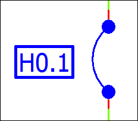

# EPLAN Fluid: Определение групп соединений и проводов

Fluid-соединения могут определяться как устройство: либо как ***группа соединений***, в которой объединены несколько шлангов, либо как ***трубо-*** или ***шлангопровод***. В связи с этим имеются следующие определения функций категории ***Группа соединений / провода***:

* Определение группы соединений
* Определение трубопровода
* Определение шлангопровода.

Определение группы соединений для группы соединений шлангов

Определение функции "Определение группы соединений" позволяет объединять несколько параллельно проходящих шланговых соединений в одну группу соединений и обращаться с ней как с устройством. В этом случае определение группы соединений используется как определение кабеля и размещается с использованием тех же пунктов меню (Вставить > Определение кабеля). EPLAN Fluid автоматически распознает необходимость вставить линию определения группы соединений на основании используемого типа страниц "Схема соединений, Fluid-Техника (I)".

Графическое представление определения группы соединений на схеме соединений осуществляется с помощью ***линии определения группы соединений*** (символ PDL из библиотеки символов SPECIAL), перетаскиваемой при вставке в требуемые Fluid-соединения, которые должны быть составной частью группы соединений.

После вставки линии определения группы соединений точки обозначения соединения автоматически размещаются в каждой точке пересечения линии определения группы соединений с линией автоматического соединения Fluid-соединения. Чтобы определить группу соединений шлангов, определения функции точек определения соединения должны быть настроены на значение "Шланг".

С помощью пунктов меню Параметры > Настройки > Проекты > "Имя проекта" > Устройство > Группа соединений в диалоговом окне Настройки: Группа соединений можно изменить символ и вариант точек определения соединения. Например, для шланга можно использовать символ CDPCP2F5. В этом случае, чтобы получить правильное представление группы соединений, необходимо сделать невидимой соответствующую линию определения группы соединений.

Значения в полях Видимое ОУ, Длина, Поперечное сечение / Диаметр и Единица измерения группы соединений передаются на все имеющиеся там соединения, если в соответствующих полях диалогового окна "Свойства" автоматически размещенной точки определения соединения отсутствуют данные.

Определения трубо- / шлангопровода

Fluid-соединения определяются также в виде проводов, являющихся устройствами, на которых можно задать обозначения устройств. Имеется возможность определить такое устройство как трубо- или шлангопровод, в котором ему присваивается определение функции ***Определение трубопровода*** или ***Определение шлангопровода***.

Чтобы иметь возможность размещать трубопроводы или шлангопроводы на схеме соединений Fluid как символы, EPLAN Fluid подготовил после установки соответствующий макрос символа. Для ***трубопроводов*** это макрос символа Pipe1–Pipe5, для ***шлангопроводов — *** макрос символа Hose.ems (см. след. рис.).

Нужный макрос символа нужно просто вставить в Fluid-соединение и задать на размещенном таким образом устройстве ОУ. Правильное определение функции предустановлено уже после вставки.

### Отображение в навигаторах

Определения группы соединений, трубопроводов и шлангопроводов отобразятся в навигаторе устройств, а ***не*** в навигаторе кабелей. Соответственно, можно воспользоваться этими пунктами меню, пройдя по пути меню Данные проекта > Устройство >... также для определений группы соединений, трубопроводов и шлангопроводов (напр., Нумеровать).

В структуре дерева навигатора устройств под ОУ группы соединений / проводов отображаются соответствующие определения группы соединений или проводов. Кроме того, для определения группы соединений, трубопроводов и шлангопроводов (размещенных / неразмещенных) используются те же пиктограммы, что и для определения кабеля (например, {: .ui-icon }{: .ui-icon }).

Чтобы отображать в навигаторе устройств только устройства, которые создавались посредством определения группы соединений, трубопроводов и шлангопроводов, можно использовать в качестве критерия фильтра определение функции "Определение группы соединений", "Определение трубопровода" и "Определение шлангопровода". Чтобы в навигаторе соединений были видны только соединения, сгенерированные с помощью определений группы соединений или проводов, в качестве критерия фильтра можно использовать свойство Соединение: Принадлежность (ид. 31142) со значением "Группа соединений" или "Провод".

### Отчеты

Для вывода определенных групп соединений, трубопроводов и шлангопроводов можно использовать типы отчета "Спецификация изделий", "Групповая спецификация изделий", "Список обозначений устройств", "Таблица соединений" и "Схема группы соединений / проводов". Свойственные для кабеля отчеты нельзя сгенерировать для таких устройств.

Чтобы вывести в таблице соединений только те шланговые соединения, которые создавались посредством определения группы соединений, в качестве критерия фильтра можно использовать свойство Соединение: Принадлежность (ид. 31142) со значением "Группа соединений".

Если на схеме группы соединений / проводов нужно вывести только трубопроводы или шлангопроводы, образованные посредством определения трубопровода или шлангопровода, в качестве критерия фильтра можно использовать свойство Соединение: Принадлежность (ид. 31142) со значением "Провод".

**См. также:**

* [Вставить группы шланговых соединений, трубопроводы и шлангопроводы](ftechnic_h_paketedefinieren.md)
* [Соединения](connectionbrowsergui_k_start.md)
* [EPLAN Fluid: Соединения](ftechnic_k_verbindungen.md)
