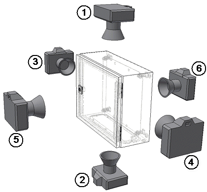
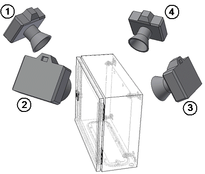

# Обзоры модели

Обзоры модели являются стандартизированными обзорами 2D трехмерного чертежа монтажных поверхностей. В зависимости от степени детализации они служат для представления комплектных установок, оснащенных монтажных поверхностей или отдельных компонентов. Создаваемые таким образом чертежи могут использоваться в качестве документации или технической документации. Дополнительные сведения, такие как указание размеров, тексты и т. д. для производства электрошкафов (оснащение электрошкафов), можно автоматически или вручную обозначить стандартными функциями платформы в обзорах моделей.

Обзор модели определяется посредством указания двух точек. В обзоре модели в масштабированном виде отображается содержимое трехмерного вида, напр. оснащенные монтажные поверхности с размещенными в них функциональными элементами.

Обзор модели можно вставить на страницу любого типа.

### Скопировать и вставить обзоры модели

!!! note "Замечание:"

    Копирование обзора модели хотя и возможно, но имеет смысл только внутри одного проекта. Поскольку при вставке в другой проект внутренние связи между пространством листа и обзором модели теряются, там генерируется только копия графики. Ответные действия на изменения в пространстве листа в копии обзора модели уже не возможны.

### Возможности выравнивания

Обзор модели может выравниваться путем выбора точки наблюдения как ортогонально, так и изометрически:

Ортогональные виды

К ортогональным видам относятся параметры Вверху (1), Внизу (2), Слева (3), Справа (4), Спереди (5) и Сзади (6).

Изометрические виды

Изометрические виды, в которых трехмерные представления отображаются в двух измерениях, содержат следующие параметры: ЮЗ изометрия (1), ЮВ изометрия (2), СВ изометрия (3) и СЗ изометрия (4).

Обозначения четырех изометрических точек наблюдения (юго-восток, юго-запад, северо-восток, северо-запад) указывают сторону света, ***с*** которой смотрит на модель картушка компаса, спроецированная на основание модели. Ось Y (зеленая) указывает северное направление. Кроме того, угол зрения повернут на 60° вниз.

### Отображение косых поверхностей в обзоре модели

Угол зрения в обзорах моделей обычно соотносится с координатами пространства листа. Косая поверхность, например передняя сторона пульта управления, не видна в обзоре модели в фактических размерах, так как из-за своего положения отображается в укороченном виде из-за прямоугольного вывернутого ракурса. Из-за этого масштабирование не отображает действительные длины.

Для того чтобы в обзоре модели можно было правильно масштабировать косые поверхности, имеется свойство Обзор модели: Занять точку наблюдения за монтажной поверхностью. Если активировать это свойство во вкладке Вид диалогового окна Обзор модели, вид косо расположенного функционального элемента будет выровнен на своей монтажной поверхности. За счет этого осуществляется правильное ортогональное отображение в обзоре модели даже выровненного по косой функционального элемента. Сгенерированные после этого указания размеров соответствуют реальным значениям.

!!! example "Пример:"

    (1): Вид на косую поверхность***без***активированногосвойства Обзор модели: Занять точку наблюдения за монтажной поверхностьюи результат в обзоре модели(2): Вид на косую поверхность***с***активированным свойством Обзор модели: Занять точку наблюдения за монтажной поверхностьюи результат в обзоре модели

**См. также:**

* [Вставить обзоры модели](gededit3dgui_h_bearbeiten.md)
* [Вкладка Вид (обзор модели)](gededit3dgui_r_modell.md)
