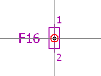
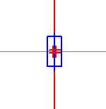

# Активировать логический захват

Логический захват помогает точнее выбрать символы или макросы и быстрее разместить их на выбранные соединения.

Условие:

Вы открыли страницу, форму, рамку или символ.

1. Чтобы активировать или отключить эту опцию, выберите пункты меню Параметры > Логический захват.

### Выбрать символы с помощью логического захвата

1. Чтобы активировать логический захват, выберите пункты меню Параметры > Логический захват.
2. Нажмите клавишу ++Q++ прежде, чем подвести курсор к символу.

!!! info "Для сведения:"

    Точка вставки символа используется как точка захвата (т. е. курсор отводится к точке вставки). В графическом редакторе это обозначается при помощи небольшого кружка.

### Разместить символы с помощью логического захвата

1. Чтобы активировать логический захват, выберите пункты меню Параметры > Логический захват.
2. Сначала выберите необходимую операцию (например, Вставить > Символ), а затем нажмите ++Q++.

!!! info "Для сведения:"

    В этом случае логический захват действует на точки вывода устройства символов. Выводы устройств символа перемещаются преимущественно на имеющуюся или возможную линию соединения. Это помечается в графическом редакторе небольшим двойным кружком.

!!! info "Для сведения:"

    После того как действие завершено, логический захват снова отключается.

**См. также:**

* [Графический редактор](gededitgui_k_start.md)
* [Отобразить точки вставки](gededitgui_h_einfuegepunkte.md)
