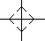
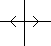
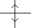

# Использование ортогональной функции

Ортогональная функция обеспечивает перемещение курсора только в горизонтальном и вертикальном направлении. При этом курсор имеет специальную форму, которая называется ***ортогональным курсором***. Эта функция используется в том случае, если при вставке символов требуется выровнять все точки вставки вертикально или горизонтально по отношению друг к другу.

Условие:

Вы открыли страницу, форму, рамку или символ.

1. Нажмите клавиши ++Shift++ \+ [<] для активации ортогональной функции.

!!! info "Для сведения:"

    Курсор можно двигать только в горизонтальном и вертикальном направлении. Форма курсора указывает настроенный режим с помощью четырех стрелок.

2. Нажмите клавишу ++<++ для отключения ортогональной функции.

!!! info "Для сведения:"

    Курсор снова можно перемещать в любом направлении.

### Активация ортогональной функции только для горизонтального или вертикального направления.

1. Нажмите клавишу ++<++ для активации ортогональной функции в горизонтальном направлении.

!!! info "Для сведения:"

    Курсор вновь можно перемещать только в горизонтальном направлении. Форма курсора указывает настроенное направление с помощью двух стрелок.

2. Нажмите клавишу ++<++ второй раз для активации ортогональной функции в вертикальном направлении.

!!! info "Для сведения:"

    Курсор можно перемещать только в вертикальном направлении. Форма курсора указывает настроенное направление с помощью двух стрелок.

3. Нажмите клавишу ++<++ еще раз для отключения ортогональной функции.

!!! info "Для сведения:"

    Курсор снова можно перемещать в любом направлении.

Возможны следующие формы курсора:

Курсор |  Значение
---|---
 |  Возможно движение в горизонтальном и вертикальном направлении.
 |  Возможно движение только в горизонтальном направлении.
 |  Возможно движение только в вертикальном направлении.

!!! tip "Совет:"

    Во время черчения графических элементов, после указания начальной точки, ортогональную функцию можно вызвать клавишами [X] или ++Y++. С помощью клавиши ++<++ снова отключите ортогональную функцию.

**См. также:**

* [Графический редактор](gededitgui_k_start.md)
* [Определить величины шага](gededitgui_h_schrittweitenfestlegen.md)
