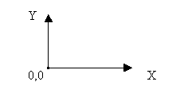
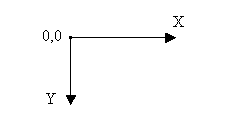
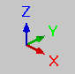

# Системы координат

В EPLAN имеются разные системы координат для графики, электротехники, Fluid-техники и технологии производственных процессов. Система координат зависит от типа страницы, при необходимости можно временно переключиться (в диалоговом окне Ввод координат) на другую систему координат. Исходная точка любой системы координат находится внизу слева на поверхности для черчения.

### Графическая система координат

Графическая система координат начинается от левой нижней точки. Данные координат относятся к начальной точке. Значения координат задаются с единицей измерения "мм".

В строке состояния отображаются координаты с X / Y.

### Логическая система координат электротехники

Электротехническая система координат начинается от левого верхнего угла поверхности для черчения. Данные координат относятся к 'самой верхней позиции схемы соединений' и настроенной сетке, т. е. значения координат указываются в шагах сетки (величина шага: 1, единица измерения сетки = 4 мм).

В строке состояния отображаются координаты с RX / RY.

Указание самой верхней позиции схемы соединений показывает, где находится логический нуль (для электротехнической системы координат). Эта настройка применяется при использовании рамки, где указывается самая верхняя позиция. Так как логическая сетка всегда выравнивается по внутреннему началу координат (0,0 внизу слева), самая верхняя позиция схемы соединений является лишь приблизительным значением, которое округляется до ближайшего размера сетки.

### Логические системы координат Fluid-Техника и технология производственных процессов

Координатная система 'Fluid-техника' и координатная система 'Технология производственных процессов' начинаются от левой нижней точки. Данные координат относятся к начальной точке и настроенной сетке, т.е. координатные значения выводятся в шагах сетки.

В строке состояния отображаются координаты с RX / RY.

При увеличении страницы из-за переключения на другой формат листа (например, с DIN A3 на DIN A2), страница расширяется вверх и вправо. Благодаря этому нет необходимости в обработке отрицательных координат. Макросы и т.д. размещаются в листе большего размера внизу слева.

### Трехмерная система координат

В изометрическом виде пространства листа видны все три оси системы координат. Оси обозначены разными цветами:

* Ось X: красный
* Ось Y: зеленый
* Ось Z: синий

### Смещение исходной точки

С помощью смещения исходной точки можно определить опциональную исходную точку координат. На новую исходную точку указывает небольшое координатное перекрестие. В строке состояния указание координат меняется с X / Y на DX / DY (графическая система координат) или с RX / RY в DRX / DRY (логическая система координат), и значения указываются относительно исходной точки.

Относительный ввод координат при черчении графических объектов всегда соотносится с ***последней*** установленной точкой. Это необязательно должна быть точка графического объекта, это может быть и новая исходная точка координат! Таким образом, если при черчении линии была вставлена первая точка линии, а затем установлена исходная точка координат, относительные координаты будут относиться к исходной точке координат, а не к вставленной ранее точке линии.

**См. также:**

* [Графический редактор](gededitgui_k_start.md)
* [Переместить исходную точку координат](gededitgui_h_bezugspunktverschiebung.md)
* [Ввести координаты при черчении](gededitgui_h_koordinatenbeimzeichnen.md)
* [Диалоговое окно Ввод координат](gededitgui_d_koordinateneingabe.md)
* [Диалоговое окно Относительный ввод координат](gededitgui_d_relativekoordinaten.md)
