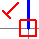
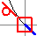

# Захват объекта

Тексты и логические элементы (символы, черные ящики) имеют ***точки вставки***. Они отображаются с помощью небольшого заполненного прямоугольника. Графические элементы имеют ***точки элемента*** (например, начальные и конечные точки). Они отображаются с помощью небольшого незаполненного прямоугольника.

!!! example "Пример:"

    На следующем рисунке представлены точки вставки (1) и точки элементов (2).

Если активирована опция Захват объекта, эти точки используются как точки захвата. В этом случае графические объекты при вставке автоматически привязываются к этим точкам захвата.

Дополнительно к точкам элементов другие точки используются как точки захвата.

* Средние точки линий и сегментов ломаных линий
* Средние точки кругов, дуг и эллипсов
* Точки пересечения элементов.

### Основание перпендикуляра и точка касательной

Если параметр Захват объекта активирован, то при черчении графических элементов основание перпендикуляра  или точка касательной  отображается у курсора, как только становится возможным построение вертикального или касательного элемента линии.

Если параметр Захват объекта выключен, данные (и другие) точки не используются как точки захвата и соответственно не отображаются.

### Режим перпендикуляра или режим касательной при черчении

Независимо от параметра Захват объекта при черчении определенных графических элементов (линий, окружностей и т. д.) во всплывающем меню имеются два режима: Перпендикуляр и Касательная.

С помощью этих функций можно начертить перпендикуляр или касательную линию. Если во всплывающем меню выбран один из этих режимов, у курсора меняется пиктограмма. Соответствующие режимы при этом доступны для следующих графических элементов:

* Режим Перпендикуляр (курсор: {: .ui-icon }): для кривых, ломаных и многоугольников
* Режим Касательная (курсор: {: .ui-icon }): для кривых, ломаных и многоугольников, окружностей, дуг через центр и секторы.

**См. также:**

* [Графический редактор](gededitgui_k_start.md)
* [Активировать захват объекта](gededitgui_h_fangpunkte.md)
* [Начертить перпендикулярные или касательные линии](gededitgui_h_lotrechttangentialzeichnen.md)
