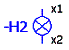
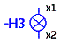
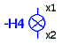
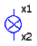
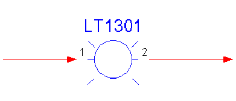
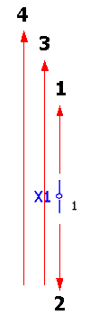
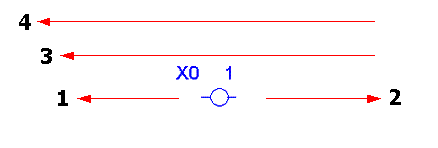
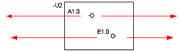
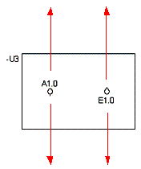
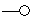

# Оценка функциональных текстов зон

Функциональный текст зоны учитывается в отчете на логических страницах (например, на страницах схемы соединений с многополюсным или однополюсным представлением, страницах обзора и т. д.). Для всех других типов страниц функциональные тексты зон рассматриваются как графические тексты.

С выводами устройства ПЛК и символами каналов на страницах обзора ПЛК связана одна особенность. Если в эти функции не внесен собственный функциональный текст, свойство Функциональный текст (автоматически) показывает не функциональный текст зоны, а автоматический функциональный текст соответствующего вывода устройства ПЛК на многополюсной странице схемы соединений. Этот функциональный текст тоже может быть определен из какого-либо функционального текста зоны. В случае c символами каналов копирование функционального текста выполняется с помощью точки вставки символа, а не через позицию вывода устройства В/В.

### Оценка в случае общих функций

Поиск в зоне, в которой находится условное обозначение, выполняется — в зависимости от настройки для свойства Направление генерации отчета используемой рамки — сверху вниз или слева направо. С помощью поиска ищется самый верхний или самый левый функциональный текст зоны. Функциональный текст зоны определяется для каждой функции, независимо от того, идет ли речь о главной или вспомогательной функции.

В таблицах соединений всегда выводится функциональный текст условного обозначения, к которому подсоединено данное соединение. В списках обозначений устройств и спецификациях выводится только главная функция, поэтому используется только ее текст функции.

При поиске сверху вниз выполняется поиск самого верхнего функционального текста зоны.

 | H3 текст зоны 1 |  |
---|---|---|---
**Направление поиска 1** | H3 текст зоны 2 |  |
 |   |   |  
 | H3 текст зоны 3 | H4 текст зоны 1 | H4 текст зоны 3
**Направление поиска 2** | H3 текст зоны 4 | H4 текст зоны 2 |

При поиске слева направо выполняется поиск самого левого функционального текста зоны.

**Направление поиска 1** |   | **Направление поиска 2**
---|---|---

С помощью настройки проекта Распространить функциональный текст зоны на всю зону (путь: Параметры > Настройки > Проекты > "Имя проекта" > Графическая обработка > Общее) можно распространить поиск функционального текста зоны на всю зону.

### Отчет в случае клемм и контактов штекера

В зависимости от направления генерации отчета используемой рамки поиск выполняется сверху вниз или слева направо.

При направлении генерации отчета "Вертикальный" сначала выполняется поиск от клеммы в той же зоне вверх. После этого выполняется поиск зоны от клеммы вниз. Если не найден функциональный текст зоны, выполняется поиск снизу вверх в зонах, которые находятся слева от клеммы.

**Направление поиска** |
---|---
 |

!!! example "Пример:"

    Для клеммыX2:1при поиске от клеммы вверх в той же зоне не найден функциональный текст зоны. После этого выполняется поиск зоны схемы соединений от клеммы вниз и обнаруживается функциональный текст зоныABC (1).Для клеммX2:2иX2:3при поиске в той же зоне ни сверху, ни снизу функциональный текст зоны не обнаруживается. Затем выполняется поиск зон слева от клемм снизу вверх, и в зоне клеммыX2:1обнаруживается функциональный текст зоныDEF (2+3).Для клеммыX3:4при поиске от клеммы вверх не найден функциональный текст зоныGHI (4). Для клеммX3:5,X3:6иX4:7при поиске обнаруживается только лежащий в зоне слева от клемм функциональный текст зоныJKL (5+6+7).

При направлении генерации отчета "Горизонтальный" сначала выполняется поиск от клеммы в той же зоне налево. После этого выполняется поиск зоны от клеммы направо. Если там не найден функциональный текст зоны, выполняется поиск справа и налево в зонах, которые находятся над клеммой.

**Направление поиска**
---

#### Многоуровневые клеммы

В случае многоуровневых клемм оценивается функциональный текст зоны для каждого уровня клемм, т.е. функциональный текст может быть разным для каждого уровня.

В таблицах соединений всегда используется функциональный текст того уровня, который был найден как цель; в спецификациях всегда используется функциональный текст уровня 0.

### Отчеты для вывода устройства ПЛК, выводы устройств

Сначала поиск выполняется против направления вывода устройства, начиная от вывода устройства ПЛК. Если там не найден функциональный текст зоны, выполняется поиск в направлении вывода устройства.

| Вывод устройства слева
направление поиска 2 |  |  Вывод устройства слева
направление поиска 1
---|---|---

Вывод устройства справа
направление поиска 1 |  | Вывод устройства справа
направление поиска 2
| Вывод устройства внизу
направление поиска 1 |  | Вывод устройства вверху
направление поиска 2
---|---|---

Вывод устройства внизу
направление поиска 2 |  | Вывод устройства вверху
направление поиска 1

Последовательность поиска для вывода устройства ПЛК и выводов устройства можно инвертировать с помощью настроек проекта Инвертировать последовательность поиска для вывода устройства ПЛК (в диалоговом окне Графическая обработка  Общее).

| Вывод устройства слева
направление поиска 1 |  | Вывод устройства слева
направление поиска 2
---|---|---

Вывод устройства справа
направление поиска 2 |  | Вывод устройства справа
направление поиска 1
| Вывод устройства внизу
направление поиска 2 |  | Вывод устройства вверху
направление поиска 1
---|---|---

Вывод устройства внизу
направление поиска 1 |  | Вывод устройства вверху
направление поиска 2

Если в выводе устройства ПЛК не найден функциональный текст зоны, отображается Функциональный текст (автоматически) связанного датчика или исполнительного элемента.

С помощью настройки проекта Расширенное копирование функционального текста зоны (меню Параметры > Настройки > Проекты > "Имя проекта" > Устройство > ПЛК) можно распространить поиск функционального текста зоны на всю зону. Если ни один из указанных выше случаев не имеет места, осуществляется (как и в случае с клеммами) поиск функционального текста зоны среди имеющихся зон. Найденный функциональный текст копируется в зависимости от направления вывода устройства слева или сверху.

Следующая таблица в наглядной форме представляет "предпочтительный" способ копирования при стандартной процедуре поиска (деактивировать настройки проекта инвертировать последовательность поиска для выводов устройства ПЛК). Сначала зоны исследуются в противоположном направлении, а потом в направлении вывода устройства.

Направление вывода устройства |  Копирование функционального текста из
---|---
 (по верхнему краю) |  слева (направление поиска сначала вниз, потом вверх)
 (по нижнему краю) |  слева (направление поиска сначала вверх, потом вниз)
 (слева) |  сверху (направление поиска сначала направо, потом налево)
 (справа) |  по верхнему краю (направление поиска сначала налево, потом направо)

### Отчет для символов каналов

Кроме выводов устройства ПЛК в EPLAN также поддерживаются символы каналов ПЛК. При этом речь идет о символах, которые объединяют несколько выводов устройства ПЛК. Так как направление вывода устройства (а тем самым и направление поиска для функционального текста зоны) обычно одинаково для всех символов каналов, оно всегда ориентируется по первому выводу устройства.

!!! note "Замечание:"

    Определения клеммников и штекеров, а также выводы потенциала не оценивают функциональный текст зоны. Используется введенный вручную текст функциональный текст.

**См. также:**

* [Функциональные тексты зон](gededitgui_k_pfadtextstart.md)
* [Функциональные тексты зон: Принцип](gededitgui_k_pfadtextprinzip.md)
* [Вставить и обработать функциональные тексты зоны](gededitgui_h_pfadtexteinfuegen.md)
