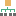
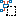
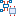

# Диалоговое окно Макросы — <Имя проекта>

* Вы открыли ***Проект макросов*** и вставили в этом проекте объекты (например, страницы с фрагментами схемы соединений в рамках макроса) для генерируемых макросов. Данные проекта > Макросы > Навигатор.
* Вы открыли ***проект схемы соединений***. Открыта страница в графическом редакторе. Вы вставили макросы окна / страницы.

В этом диалоговом окне отображаются макросы, которыми вы управляете в проектах макросов или которые вы вставили в проекты схем соединений.

* В ***проекте макросов*** для подготовленного макроса отображаются все виды представления и варианты, которые затем сохраняются в файле макроса при генерации. Это относится ко всем типам макросов.
* В ***проекте схемы соединений*** отображаются только вставленные виды представления и варианты макроса окна и / или символа, а не все варианты, имеющиеся в файле макроса.

!!! note "Замечание:"

    Чтобы в проекте схемы соединений вставленные макросы окна и символа можно было отображать и обновлять в навигаторе макросов, необходимо также вставлять рамки макросов. Для этого активируйте настройку проекта [Вставить также рамки макросов](gedviewer_d_einstellungenprojektallgemein.md). В качестве альтернативы при подготовке макросов в проекте макросов можно отдельно указать для каждого макроса, следует ли вместе с ним вставлять рамку макроса. Настройка, выполненная на рамке макроса с помощью раскрывающегося списка [Вставить также рамку макроса](macrosgui_r_makrokasteneinstellungen.md), имеет приоритет перед настройкой проекта.

С помощью всплывающего меню можно обработать свойства макросов.

Обзор основных элементов диалогового окна:

На вкладке Дерево макросы отображаются в виде иерархической структуры. Высшим уровнем иерархии является проект, далее макросы распределяются по уровням иерархии с соответствующим методом использования.

Если генерируемые или вставленные макросы в установленном каталоге макросов сохраняются в подкаталогах, эта структура каталогов отображается как следующий нижний уровень иерархии. Макросы, для которых не указано имя на вкладке Определение макроса или Рамка макроса, располагаются в структуре дерева на уровне "Без имени". При этом для страниц без имени макроса, на которых дополнительно отсутствует рамка макроса, отображается отдельный уровень структуры дерева "Без имени".

Под макросами отображаются их виды представления и варианты. При этом для различных типов макросов используются разные пиктограммы, а для видов представления — те же пиктограммы, что и для типов страниц.

Имеющиеся в макросе ***объекты-заполнители*** отображаются под уровнем иерархии для соответствующего варианта макроса.

* Если в варианте макроса имеется несколько объектов-заполнителей, они отображаются под вариантом макроса в соответствии с их графической последовательностью.
* Для объектов-заполнителей, которые находятся во вложенных рамках макросов во "внутренней" рамке макроса, используется маленькая пиктограмма в виде якоря.

В представлении структуры дерева навигатора макросов отображаются в том числе следующие пиктограммы:

Пиктограмма |  Значение
---|---
{: .ui-icon } |  Обозначает уровень проекта. Эти пиктограммы отображаются только в том случае, если открыто несколько проектов.
{: .ui-icon } |  Каталог (согласно пути, указанному в имени макроса)
{: .ui-icon } |  "Незаданные" или "нижестоящие" макросы
{: .ui-icon } |  Определяющие макросы
{: .ui-icon } |  Ссылающиеся макросы
{: .ui-icon } |  Макрос окна
{: .ui-icon } |  Макрос символа
{: .ui-icon } |  Макрос страницы
(напр., {: .ui-icon }) |

* Макросы окон и символов: Вид представления рамки макроса (здесь, например, многополюсный)
* Макросы страницы: Тип страницы

{: .ui-icon } |  3D-макросы: Пространство листа
{: .ui-icon } |  Вариант макроса
{: .ui-icon } |  Объект-заполнитель

(Обзор основных пиктограмм для данных проекта вы найдете в разделе [Пиктограммы для навигаторов](userinterface_k_iconsnavigatoren.md).)

!!! note "Замечание:"

    * Из подготовленных 3D-макросов, которые хранятся в пространствах листа определенного проекта макросов, позже будут сгенерированы 3D-макросы окна (*.ema) или 3D-макросы символа (*.ems). Соответственно, для этих подготовленных 3D-макросов будут отображаться те же пиктограммы, что и для 2D-макросов окна или 2D-макросов символа.
    * На уровне иерархии с видом представления / типом страницы для подготовленных 3D-макросов отображается пиктограмма пространства листа {: .ui-icon } с текстом "Трехмерный чертеж монтажных поверхностей". При генерации макросов 3D-макросам автоматически присваивается вид представления "Трехмерный чертеж монтажных поверхностей".

На вкладке Список по умолчанию отображается тип макроса, имя макроса, вид представления, вариант, описание и имя файла макроса. В ***проекте макросов*** некоторые из этих свойств можно обрабатывать поблочно, как в табличной обработке. В ***проекте схемы соединений*** данные свойств только отображаются и недоступны для обработки.

!!! note "Замечание:"

    В списке навигатора можно обработать только один объект. По этой причине в представлении в виде списка навигатора макросов объекты-заполнители недоступны.

!!! tip "Совет:"

    Используйте свойство Макрос: Каталог, чтобы с легкостью обрабатывать каталоги макросов в проекте макросов. Чтобы напрямую обработать запись в добавленном столбце Макрос: Каталог, в соответствующей ячейке таблицы нажмите клавишу ++F2++. Скопируйте и вставьте измененный каталог, чтобы перенести его в несколько выделенных каталогов.

### Фильтр

В этом раскрывающемся списке отображаются все доступные фильтры. Выбранный фильтр активируется автоматически и применяется как к дереву, так и к списку. Запись "- Не активировано -" отключает фильтр и приводит к тому, что данные отображаются в неотфильтрованном виде. С помощью кнопки ++...++ откройте диалоговое окно [Фильтр](modaldialogsdb_d_filternnach.md). Здесь можно создать, обработать, удалить, скопировать, экспортировать, импортировать фильтр и управлять им.

Во всплывающем меню раскрывающегося списка Фильтр содержатся следующие записи:

* Выключить: Этот пункт меню доступен, если фильтр установлен: Сбрасывает настройку фильтра до записи "- Не активировано -".
* Активировать <Имя фильтра>: Этот пункт меню доступен, если для настройки фильтра установлено значение "- Не активировано -": Повторно активирует последний активный фильтр.

Таким образом можно быстро переключаться между неотфильтрованным и отфильтрованным в соответствии с требованиями пользователя представлениями.

### Значение: <Свойство>

При помощи [быстрого ввода](modaldialogsdb_k_filter.md) в данном поле для определенного и активированного фильтра можно быстро изменить значение его критерия.

### Всплывающее меню

Всплывающее меню дает доступ, в зависимости от типа поля (например, дата, целое число, многоязычный), к пунктам меню, при помощи которых вы можете по необходимости, например, влиять на представление таблиц или обрабатывать значения в полях. Обзор пунктов этого всплывающего меню вы можете найти в разделе [Пункты всплывающего меню](userinterface_m_kontextmenu.md).

Дополнительно здесь представлены следующие пункты всплывающего меню, специфические для данного диалогового окна:

Пункт меню |  Значение
---|---
Создать (только дерево) |  Этот пункт меню доступен только в проектах макросов. Позволяет создать страницу или пространство листа для нового макроса либо вставить рамку макроса (если открыта страница) через подменю. В зависимости от выбранного уровня иерархии (каталог, другой подготовленный макрос окна и т. д.) определенные данные копируются для нового подготовленного макроса.
Удалить |  Удаляет все выделенные объекты или (в представлении структуры дерева) все объекты, расположенные ниже выделенного уровня структуры дерева. (Возможен многократный выбор объектов или уровней древовидной структуры.)
Автоматически генерировать макросы |  Этот пункт меню доступен только в проектах макросов. Автоматически генерирует макросы на основе текущего выбора (напр., отдельный подготовленный макрос).
Обновить макросы |  Открывает диалоговое окно Обновить макросы, в котором можно выполнить настройку обновления. Затем выделенные в проекте ссылающиеся или незаданные макросы [обновляются](macrosgui_h_makrokasten.md) с помощью данных из соответствующих файлов макросов.
Вставить макрос |  Вставляет макрос окна или символа из проекта макросов с методом использования "Определяющий" на страницу проекта, либо вставляет 3D-макрос в пространство листа. Это соответствует вставке макросов из навигатора макросов путем перетаскивания мышью. Многократный выбор ***невозможен***.

!!! note "Замечание:"

    Обратите внимание, что при вставке путем перетаскивания мышью или с помощью пункта всплывающего меню Вставить макрос используется состояние макроса в проекте макросов, а не сохраненное состояние макроса в файле макроса. Если обновить вставленный таким образом макрос, будет выполнен возврат к состоянию, сохраненному в файле макроса.

Присвоить набор значений (только дерево) |  Открывает диалоговое окно Выбрать набор значений – <Имя заполнителя>, где выделенным объектам-заполнителям можно присвоить набор значений.
Выделить соответствующие объекты (только дерево) |  Выделяет в графическом редакторе все объекты, относящиеся к текущему объекту-заполнителю.
Перейти к (графика) |  Отображает выделенный объект в графическом редакторе или в пространстве листа.
Вставить в список результатов поиска |  Позволяет вставить в список результатов поиска все выделенные объекты. Их можно снова отобразить позже через пункты меню Поиск > Отобразить результаты.
Список с предварительным выбором (только дерево) |  Уменьшает число отображаемых элементов, чтобы ускорить ориентирование в представлении в виде списка. Если этот параметр активирован, представление в виде списка вызывается с автоматическим фильтром (предварительный выбор), причем этот фильтр содержит только что выбранные элементы.
Выбрать в дереве (только список) |  Показывает выделенный объект во вкладке Дерево.
Табличная обработка |  Открывает табличную обработку с возможностью обрабатывать свойства выделенных объектов.
Свойства |  В зависимости от выделения открывает соответствующее диалоговое окно свойств для обработки свойств макроса.

**См. также:**

* [Макросы](macrosgui_k_start.md)
* [Навигатор макросов](macrosgui_k_makronavigator.md)
* [Использовать рамки макросов](macrosgui_h_makrokasten.md)
* [Автоматически генерировать макрос из проекта макросов](macrosgui_h_makrosausmakroprojekt.md)
* [Генерировать объекты-заполнители](macrosgui_h_platzhalterobjekteerzeugen.md)
* [Расширить объекты-заполнители](macrosgui_h_platzhalterobjekteerweitern.md)
* [Конфигурировать представления в виде списка и структуры дерева](modaldialogsdb_h_spaltenkonfigurieren.md)
