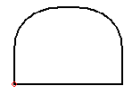
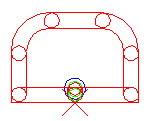
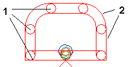
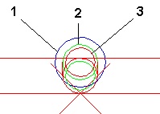
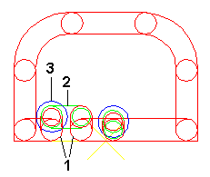

# Запись данных ЧУ: принцип

Запись данных ЧУ —это программа ЧУ, которая может высверлить и фрезеровать контур на машине. Здесь детально рассматриваются конкретные возможности машины и ее инструментов. Контур графически создается в редакторе контуров и снабжается специальной информацией о машине при генерировании записи данных ЧУ.

Когда в диалоговом окне Запись данных контура ЧУ настроены все значения диалогового окна, на прямой контура устанавливается начальная точка. После этого по контуру вырисовывается траектория фрезы в виде графического представления программы ЧУ.

!!! note "Замечание:"

    Программа не позволяет разместить начальную точку слишком близко к дугам окружностей, закруглению или вершине прямоугольника. В этом случае ввод игнорируется. В строке состояния появляется сообщение о неверной позиции и предложение определить другую начальную точку.

### Метод представления путей фрезерования и точек сверления

#### Пути фрезерования

Каждая конечная точка этапа выполнения программы (перемещение по прямой или дуге) отображается в виде круга (1). Траектория фрезы представлена параллельными линиями, дугами или круговыми сегментами (2).

#### Цветное обозначение точек сверления и позиционных знаков

Синий: позиция предварительного сверления (1)

Зеленый: позиция фрезы над заготовкой (2)

Красный: позиция фрезы внутри заготовки (3).

Когда фреза подается или отводится, это происходит в одной позиции X/Y, т. е. красный и зеленый круг генерируются в одном месте. Чтобы можно было визуально отличить точки подачи и отвода, второй круг (этап выполнения программы) изображается чуть меньше, чем первый:

* Большой зеленый круг с маленьким красным кругом внутри: подача в заготовку снаружи (рисунок).
* Большой красный круг с маленьким зеленым внутри: отвод из заготовки вверх.

### Размещение дополнительных отверстий

В управлении контуром можно создать дополнительные отверстия. В этих местах будет применяться выбранное сверло. Отверстие можно разместить свободно или на точках захвата контура.

### Размещение технологических перемычек

Технологические перемычки —это перерывы в процессе фрезерования, которые размещаются по заданной ширине на прямых отрезках контура. В этих местах материал останавливается. При этом автоматически генерируется необходимое предварительное сверление.

#### Цветное обозначение

Красный: перемещение фрезы в материале (1)

Зеленый: перемещение фрезы над материалом (2)

Синий: предварительное сверление (3).

### Сгенерированные записи данных ЧУ

!!! note "Замечание:"

    * Проверка возможности фрезерования машиной созданного или экспортируемого контура не проводится. Все заданные значения контура всегда передаются на машину. Пользователь должен проверить непосредственно на машине, может ли она ли обработать контур.
    * Чтобы минимизировать опасность повреждения заготовок и инструментов из-за неправильного экспорта ЧУ, ***перед*** замыканием контура ЧУ следует провести проверку заданной записи данных контура ЧУ. Так, например, нужно следить за тем, чтобы диаметр фрезы не был слишком большим при работе с закруглениями и углами.
    Во многих случаях бывает надежнее и проще использовать стандартные контуры (круг, прямоугольник с фаской / закругленный, продольное отверстие, шестигранник, восьмигранник).

Сгенерированные записи данных ЧУ после закрытия контура вносятся в файл контура. При генерировании экспорта ЧУ контур и записи данных ЧУ передаются в программу ЧУ и выводятся вместе с машинными файлами вывода. Контуры и пути фрезерования можно просмотреть в программе управления машиной.

Чтобы сделать видимыми в открытом контуре сохраненные записи данных ЧУ, используйте функции Вид > Следующая запись данных ЧУ и Вид > Предыдущая запись данных ЧУ.

**См. также:**

* [Генерирование и обработка записей данных контура ЧУ](contoureditorgui_h_nckonturdatenbearbeiten.md)
* [Диалоговое окно Запись данных контура ЧУ](contoureditorgui_d_ncdatensatz.md)
