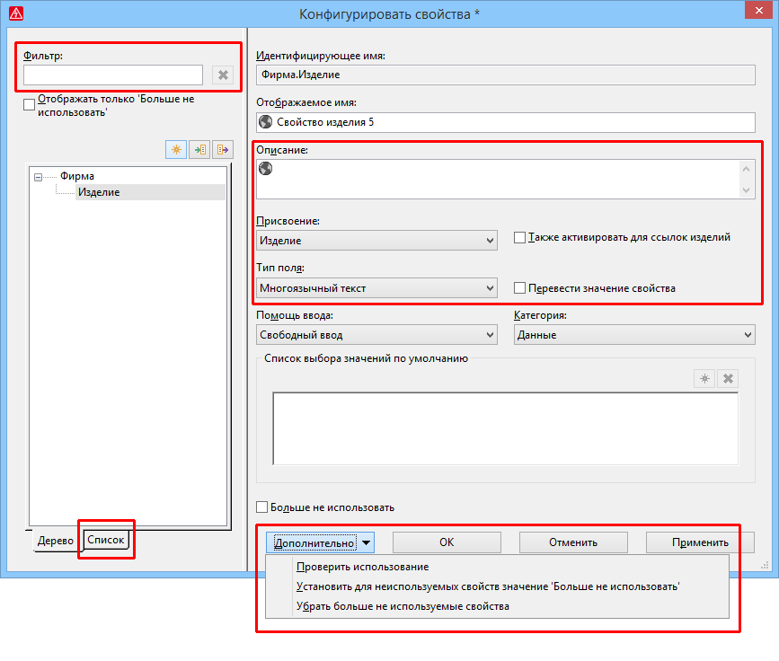
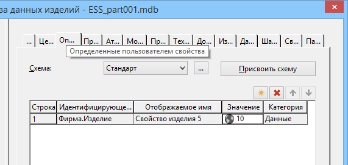

# Расширения для определенных пользователем свойств

Подобно определенным пользователем свойствам в проекте в базе данных изделий теперь также доступны настраиваемые, определенные пользователем свойства. В рамках этого усовершенствования была расширена конфигурация определенных пользователем свойств. Это относится к определенным пользователем свойствам как в проекте, так и в базе данных изделий.

### Определенные пользователем свойства для базы данных изделий

Чтобы создать и сконфигурировать определенные пользователем свойства для изделий, выберите в базе данных изделий пункты меню ++Дополнительно++ > Конфигурировать свойства.

Эффект:

Определенные пользователем свойства для базы данных изделий имеют те же характеристики, что и определенные пользователем свойства для проекта. Это обеспечивает универсальность концепции ввода и отображения дополнительных сведений внутри платформы EPLAN.
При конфигурации определенные пользователем свойства предоставляют больше возможностей по настройке в базе данных изделий по сравнению с произвольными свойствами. Например, использование конфигурируемого отображаемого имени облегчает распознавание этих свойств. Кроме того, облегчается управление переводом определенных пользователем свойств по сравнению с произвольными свойствами.

!!! note "Замечание:"

    В базе данных изделий для ввода и отображения дополнительной информации мы рекомендуем использовать ***определенные пользователем свойства***. Произвольные свойства доступны только для совместимости.

Диалоговое окно конфигурации в базе данных изделий соответствует диалоговому окну для определенных пользователем свойств в проекте. В отличие от конфигурации в проекте, созданные в базе данных изделий и определенные пользователем свойства могут быть назначены только типу объекта "Изделие".

Новое определенное пользователем свойство для изделия сохраняется в базе данных изделий и может присваиваться изделию с помощью новой вкладки Определенные пользователем свойства.

На ней с помощью кнопки {: .ui-icon } (Создать) для изделия можно свободно выбирать определенные пользователем свойства или присваивать изделию предварительно заданный набор определенных пользователем свойств с помощью кнопки ++Присвоить схему++. Если свойства уже назначены, то определенные пользователем свойства прикрепляются из схемы. Если свойство уже выбрано и существует в схеме, его значения во время присвоения не изменяются.

Определенные пользователем свойства для изделий предоставляют, в частности, такие возможности:

* С полнотекстовым фильтром идентифицирующие имена и значения определенных пользователем свойств могут использоваться в качестве искомых понятий, а с фильтром по полю — как критерии фильтрации в базе данных изделий.
* Если впоследствии выбрать изделие или устройство, определенные пользователем свойства со значениями будут перенесены в соответствующую главную функцию.
* Определенные пользователем свойства, которые в базе данных изделий присвоены разным изделиям, учитываются при синхронизации данных изделий и могут передаваться другим пользователям с помощью функций экспорта и импорта.

### Расширения в диалоговом окне конфигурации

Пункт меню для конфигурации определенных пользователем свойств в проекте был перемещен из меню Параметры в другое меню. Чтобы открыть диалоговое окно конфигурации, теперь нужно выбрать пункты меню Данные проекта > Конфигурировать свойства.

Остальные расширения в диалоговом окне Конфигурировать свойства, которые затрагивают обе конфигурации, описаны в следующих разделах.

В левой части диалогового окна существующие свойства, определенные пользователем, теперь также отображаются в представлении в виде списка.

Чтобы ограничить количество отображаемых определенных пользователем свойств, над представлением в виде дерева и представлением в виде списка доступно поле Фильтр. При этом поиск свойств выполняется как по идентифицирующему, так и по отображаемому имени.

В новое поле Описание под отображаемым именем можно ввести описательный текст, который отображается в диалоговых окнах выбора свойств для соответствующего свойства. Возможен многоязычный ввод.

Чтобы избежать путаницы при использовании определенного пользователем свойства, раскрывающийся список Использование переименован на Присвоение и перемещен вверх в правой части диалогового окна.

Этот раскрывающийся список определяет, для каких объектов должно быть доступно свойство.

Для конфигурации в базе данных изделий в качестве присвоения доступна только новая запись "Изделие". Для такого свойства изделия с помощью нового флажка Также активировать для ссылок изделий можно дополнительно указать, что новое свойство, определенное пользователем, также доступно как свойство ссылки изделия.

До сих пор определенные пользователем свойства всегда создавались как многоязычные поля. С помощью нового раскрывающегося списка Тип поля теперь можно задать символы и формат, разрешенные для определенного пользователем свойства. Например, возможны следующие типы полей: "Булево" (истина / ложь), "Десятичное число", "Многоязычный текст".

!!! note "Замечание:"

    Если для определенного пользователем свойства необходимо ввести значения с единицами измерения, выберите тип поля "Значение с единицей измерения". Этот тип поля имеет свойство "одноязычного текста", за исключением изложенных ниже ситуаций.

* Если в качестве критерия фильтра для определенного пользователем свойства при фильтрации указывается значение с единицей измерения (например, "10 к В"), то в результатах поиска также отображаются свойства, для которых это значение было указано в другой единице измерения (например, "1000 В").
* Для значений с десятичными разрядами при представлении свойств в графическом редакторе отображаются не введенные разделители разрядов ("," или "."), а разделители разрядов, указанные для операционной системы.

Определенные пользователем свойства, которые нужно перевести, теперь можно задать в диалоговом окне конфигурации. Для определенных пользователем многоязычных свойств появился новый флажок Перевести значение свойства. Установите этот флажок, если значение определенного пользователем свойства следует учитывать при автоматическом переводе проекта или автоматическом переводе в базе данных изделий.

Эффект:

С помощью типа поля и флажка Перевести значение свойства можно целенаправленно указать, какие определенные пользователем свойства релевантны для перевода. Это сокращает затраты на перевод, а автоматический перевод проекта или базы данных изделий выполняется быстрее. Переводимость значений свойств уже не зависит от проекта. Благодаря этому данная настройка сохраняется и при обмене данными определенных пользователем свойств.

Чтобы в базе данных изделий учитывались другие релевантные для перевода имена, описания и значения определенных пользователем свойств, в настройках перевода для базы данных изделий появились следующие флажки:

* Определенные пользователем свойства: Отображаемое имя
* Определенные пользователем свойства: Описание
* Определенные пользователем свойства: Списки выбора значений по умолчанию

(Путь меню для этого диалогового окна: Параметры > Настройки > Пользователь > Перевод > База данных изделий.)

Для удаления и проверки определенных пользователем свойств в диалоговом окне конфигурации под новой кнопкой [Дополнительно] доступны три пункта меню.

Свойства, для которых активирована настройка Больше не использовать, можно удалить с помощью пункта меню Убрать больше не используемые свойства. Однако эта операция невозможна для определенных пользователем свойств в проекте, которые все еще используются в основных данных. Это записывается в системных сообщениях.

Перед удалением определенных пользователем свойств сначала можно проверить, используются ли эти свойства. Для этого под кнопкой [Дополнительно] выберите пункт меню Проверить использование. В столбце Количество использований в представлении в виде списка отобразится текущее количество использований. Не использующиеся свойства получают запись "0".

Для конфигурации свойств, определенных пользователем в ***проекте***, во всплывающем меню представления в виде дерева и представления в виде списка доступен пункт меню Вставить в список результатов поиска. Через этот пункт меню в список результатов поиска заносятся найденные объекты. Это позволяет перейти к определенным пользователем используемым свойствам в графике.

С помощью пунктов меню ++Дополнительно++ > Установить для неиспользуемых свойств значение 'Больше не использовать' для неиспользуемых определенных пользователем свойств сначала активируется настройка Больше не использовать, затем эти свойства удаляются через пункт меню Убрать больше не используемые свойства.

**См. также:**

* [{: .ui-icon }
* [{: .ui-icon }
* [{: .ui-icon }
