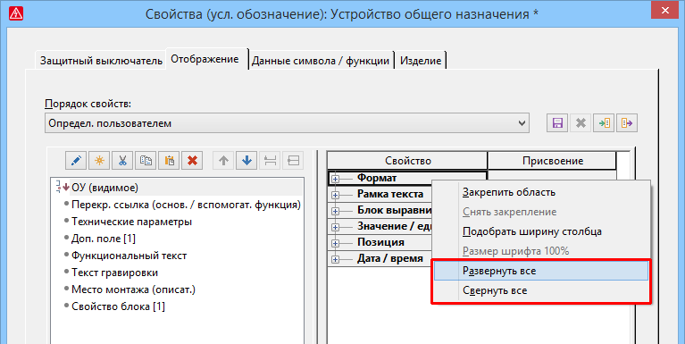

# Развернуть все древовидные представления в таблице одновременно

В разных местах интерфейса пользователя в одном столбце таблицы одно под другим отображаются несколько древовидных представлений. Чтобы можно было одновременно развернуть все древовидные представления, теперь во всплывающем меню соответствующих ячеек таблицы доступен новый пункт Развернуть все. Соответственно, новый пункт всплывающего меню Свернуть все одновременно сворачивает все древовидные представления в столбце таблицы, после чего отображается только самый верхний уровень иерархии.

Это касается, например, следующих диалоговых окон:

* Диалоговое окно Свойства (усл. обозначение): Объект-заполнитель на вкладке Присвоение
* Диалоговое окно Генерировать схему соединений ПЛК для устройств ПЛК
* Диалоговое окно 'Свойства' условных обозначений на вкладке Отображение в таблице Свойство / присвоение.

