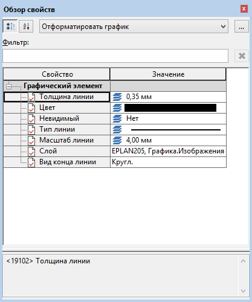

# Новое присоединяемое диалоговое окно для обработки свойств

В этой версии платформы EPLAN добавлено присоединяемое диалоговое окно 'Свойства'. Так называемый ***Обзор свойств*** работает как навигатор и может присоединяться к различным позициям в главном окне EPLAN. Чтобы открыть это диалоговое окно, выберите пункты меню Обработать > Обзор свойств.

Эффект:

Обзор свойств позволяет быстро обрабатывать свойства различных объектов без необходимости открывать и закрывать несколько диалоговых окон 'Свойства' одно за другим. Это присоединяемое диалоговое окно можно сконфигурировать так, чтобы отображались только те свойства, которые важны для вас.

В этом диалоговом окне можно обрабатывать свойства одного или нескольких выделенных объектов (тексты, графические элементы, функции, сегменты). Чтобы отобразить требуемые свойства для выделенных объектов, необходимо выбрать или создать подходящую схему для конфигурации свойств. Для графических элементов, например, можно использовать прилагаемую схему "Отформатировать график". В противном случае для свойств в столбце Значение отображается запись "Нет данных".

Чтобы создать схему, перейдите с помощью кнопки ++...++ в следующее диалоговое окно. Для конфигурации свойств используется известное диалоговое окно Конфигурировать свойства. В соответствующем окне выбора свойств можно выбрать свойства для четырех исходных объектов "Текст", "Условное обозначение", "Сегмент" и "Графический элемент".

Дополнительная информация по обзору свойств:

* Для переключения между представлением в виде дерева или представлением в виде списка в обзоре свойств можно использовать обе кнопки: {: .ui-icon } (Представление в виде дерева) и {: .ui-icon } (Представление в виде списка). В представлении структуры дерева свойства сгруппированы в соответствии с их исходными объектами.
* Чтобы ограничить количество отображаемых свойств, над таблицей свойств доступно поле Фильтр. При этом выполняется поиск имен отображаемых свойств и их значений.
* Если свойство выбрано, в нижней части диалогового окна отображается дополнительная информация об этом свойстве.
* Возможен многократный выбор одного и того же или разных объектов. Если для свойства есть разные значения, отображается запись < ++...++ >.
* В рамках этого расширения в меню Обработать были удалены оба пункта Независимые от функций свойства и Отформатировать график, а также соответствующие диалоговые окна. Для этих функций в обзоре свойств доступны соответствующие схемы со сконфигурированными свойствами.

!!! note "Замечание:"

    В диалоговом окне Обзор свойств общая обработка распределенных функций при активированном режиме ***Свойства (общие)*** ***невозможна***.

**См. также:**

* [{: .ui-icon }
* [{: .ui-icon }
