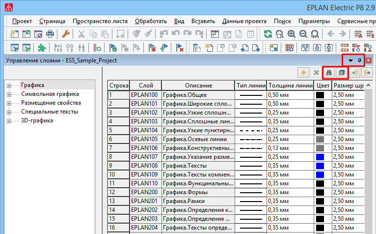

# Расширения в управлении слоями

Управление слоями в этой версии стало ***присоединяемым диалоговым окном***. Все изменения в новом диалоговом окне Управление слоями сохраняются автоматически. Кроме того, управление слоями дополнено новыми функциями, такими как поиск слоев и изменение присвоения слоев.

В рамках этого расширения теперь в диалоговом окне посредством добавленного пункта всплывающего меню Конфигурировать представление можно задавать отображение и последовательность столбцов.

Эффект:

Поскольку управление слоями теперь действует аналогично навигаторам или управлению сообщениями, вы можете разместить управление слоями так, чтобы, например, графический редактор больше не перекрывался и были сразу видны изменения для слоев. Новые функции в управлении слоями позволяют целенаправленно и удобно обрабатывать используемые слои и объекты.

### Измененный путь меню

Вызов управления слоями с версии 2.9 осуществляется по другому пути меню.

Старый путь меню |  Новый путь меню
---|---
Параметры > Управление слоями |  Данные проекта > Управление слоями

### Поиск слоев

Теперь в диалоговом окне управления слоями можно искать все объекты, которым присвоен определенный слой в проекте или в его подразделе. Для этого на панели инструментов управления слоями доступна новая кнопка {: .ui-icon } (Поиск). Это позволяет, например, находить и корректировать слои, которые добавлены в проект посредством импорта DXF / DWG или используются как определенные пользователем слои в проекте.

Прежде чем выполнить поиск, сначала в управлении слоями выделите требуемый слой для поиска. Затем выделите в навигаторе страниц проект, в котором нужно выполнить поиск. Если вы не хотите выполнять поиск по всему проекту, вы можете ограничить область поиска.

В диалоговом окне Результаты поиска — <Имя проекта> отображаются все объекты, которым присвоен искомый слой.

### Изменить присвоение слоя

Затем в списке результатов поиска можно открыть диалоговое окно "Свойства" найденного объекта и там вручную изменить присвоение искомого слоя. Или в диалоговом окне управления слоями нажмите новую кнопку {: .ui-icon } (Изменить присвоение слоя) и таким образом настройте присвоенные слои для одного или нескольких найденных объектов.

Новая кнопка также позволяет изменить присвоение слоя для других выбранных объектов (отдельных страниц / пространств листа или объектов на страницах / в пространствах листа).

В последующем открывшемся диалоговом окне используйте поля Слой источника и Целевой слой, чтобы указать, какие слои источника для выделенного объекта или объектов необходимо заменить определенным целевым слоем.

Определенные пользователем слои источника, которые больше не присвоены объекту, затем можно удалить.

**См. также:**

* [{: .ui-icon }
* [{: .ui-icon }
* [{: .ui-icon }
{: .ui-icon }[Присоединяемые диалоговые окна](userinterface_k_dialoge.md)

{: .ui-icon }[Диалоговое окно Управление слоями — <Имя проекта>](layermanager_d_ebenenverwaltung.md)

[{: .ui-icon }Работа со слоями](layermanager_h_ebenenbearbeiten.md)

[{: .ui-icon }Диалоговое окно Результаты поиска](searchandreplacegui_d_suchergebnisse.md)
