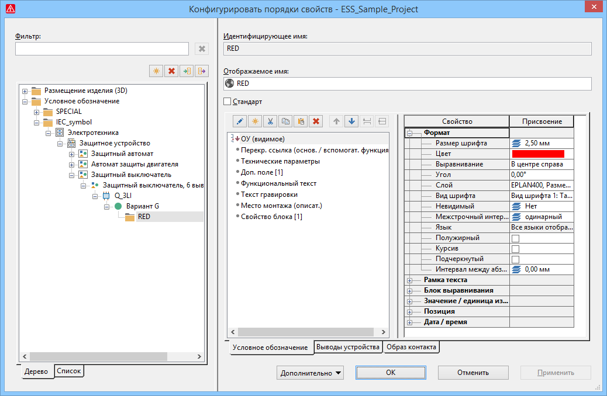
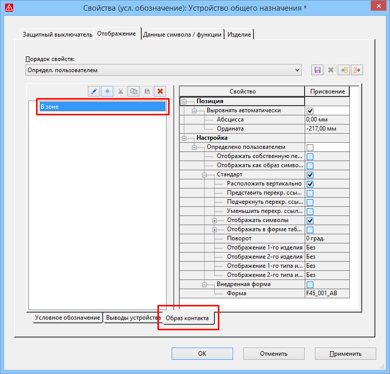

# Конфигурировать порядки свойств

Чтобы было удобнее управлять определенными пользователем и существующими в проекте порядками свойств и обрабатывать их для 3D-размещения изделий и условных обозначений, теперь на платформе EPLAN доступно новое диалоговое окно конфигурации.

Эффект:

Новое диалоговое окно конфигурации предоставляет обзор всех порядков свойств, доступных в проекте. Теперь можно экспортировать и импортировать порядки свойств для нескольких различных размещений изделий или условных обозначений, а также обрабатывать несколько порядков свойств одновременно. Кроме того, теперь можно переводить имена, с которыми порядки свойств отображаются в проекте.

Чтобы открыть диалоговое окно Конфигурировать порядки свойств, выберите путь меню Данные проекта > Конфигурировать порядки свойств. Это диалоговое окно по своей структуре похоже на уже известное диалоговое окно конфигурации свойств.

### Представление порядков свойств в виде дерева и в виде списка

В левой части диалогового окна в представлении в виде дерева и списка отображаются определенные пользователем порядки свойств, доступные в текущем проекте.

Чтобы ограничить количество отображаемых порядков свойств, над представлением в виде дерева и в виде списка доступно поле Фильтр. При этом поиск порядков свойств выполняется как по идентифицирующему, так и по отображаемому имени.

### Обработать определенный пользователем порядок свойств

С помощью кнопок над представлением в виде дерева и в виде списка определенные пользователем порядки свойств можно создавать, удалять, экспортировать и импортировать из другого проекта в текущий проект.

При создании новых порядков свойств в зависимости от выбранного уровня иерархии сначала открывается диалоговое окно Определения функций или Выбор символа. При этом выбранный уровень иерархии используется в качестве фильтра.

В правой части диалогового окна для нового определенного пользователем порядка свойств можно указать идентифицирующее и отображаемое имя. В отличие от создания порядка свойств в пространстве листа или на схеме соединений, для отображаемого имени здесь возможен многоязычный ввод.

Сама конфигурация свойств с соответствующими настройками отображения выполняется для 3D-размещений изделий на вкладке Трехмерные функции, а для условных обозначений — на вкладке Условное обозначение, а также на вкладках Выводы устройства и Образ контакта. При этом доступны такие же возможности настройки, как и на вкладке [Отображение](devicetaggui_r_anzeige.md) диалогового окна 'Свойства'.

### Проверить и убрать использование порядка свойств

Во время конфигурации можно проверить использование определенных пользователем порядков свойств и убрать неиспользуемые порядки свойств.

Для этого под кнопкой [Дополнительно] доступны пункты меню Проверить использование и Убрать неиспользованный порядок свойств. В представлении в виде списка пункт меню Проверить использование заполняет столбец Количество использований текущими числами и показывает, как часто в проекте используется соответствующий порядок свойств. Жестко заданные порядки свойств не удаляются.

Для поиска используемых определенных пользователем порядков свойств во всплывающем меню представления в виде дерева и в виде списка доступен пункт меню Вставить в список результатов поиска. Этот пункт меню проверяет использование выделенных порядков свойств в проекте и вносит найденные объекты в список результатов поиска. Благодаря этому с помощью пункта всплывающего меню Перейти к (графика) можно найти используемые порядки свойств объектов, например условные обозначения, размещения изделий и т. д., в графике.

### Измененные настройки для образа контакта

Настройки для образа контакта относятся к порядку свойств. Чтобы можно было сконфигурировать настройки образа контакта, диалоговые окна 'Свойства' для устройств в этой области были изменены.

На вкладке Отображение помимо вкладок Условное обозначение и Выводы устройства появилась новая вкладка Образ контакта. Она заменяет доступный ранее раскрывающийся список Образ контакта, а также вкладку Представление образа контакта.

Чтобы отобразить образ контакта для определенной функции, на этой вкладке щелкните по кнопке {: .ui-icon } (Создать) и в последующем диалоговом окне задайте выравнивание образа контакта ("В зоне", "На условном обозначении"). После выбора выравнивания образа контакта в правой части таблицы Свойство / присвоение можно обработать уже известные настройки образа контакта.

!!! note "Замечание:"

    * Образ контакта можно определить только для условных обозначений, но не для размещений изделий. Соответственно, вкладка Образ контакта для этих объектов недоступна.
    * Для определения позиции образа контакта при создании и обработке символов в редакторе символов новая вкладка Образ контакта доступна также в диалоговом окне Размещение свойства.

**См. также:**

* [{: .ui-icon }
