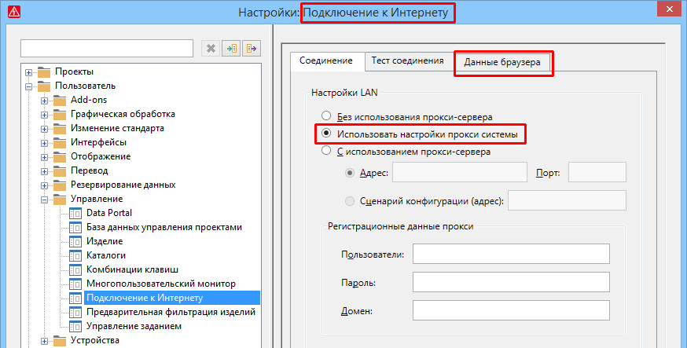

# Расширенные настройки подключения к Интернету

На платформе EPLAN имеются различные компоненты программы, которые используют окно браузера для интернет-соединения (например, EPLAN Data Portal, менеджер загрузок EPLAN и т. д.). В настройках подключения к Интернету теперь можно удалять данные браузера и задавать использование настроек прокси операционной системы.

### Удалить данные браузера всех окон браузера EPLAN

В определенных ситуациях может потребоваться удалить данные браузера для этих компонентов. Для этого прежнее диалоговое окно Настройки: Прокси-сервер дополнено вкладкой Данные браузера и переименовано:

Старое обозначение |  Новое обозначение
---|---
Настройки: Прокси-сервер |  Настройки: интернет-соединение

(Путь меню для диалогового окна "Настройки": Параметры > Настройки > Пользователь > Управление > Подключение к Интернету.)

На вкладке Данные браузера щелкните по кнопке ++Удалить++, чтобы удалить данные браузера всех компонентов программы с окнами браузера. Все предыдущие введенные данные, которые вы использовали для подтверждения или регистрации в окне браузера, будут удалены.

Чтобы данные изменения были применены, необходимо закрыть и перезапустить EPLAN. Когда вы в следующий раз откроете окно браузера, вам нужно будет выполнить подтверждение или регистрацию.

### Копировать настройки для прокси-сервера из операционной системы

Если для подключения к Интернету используется прокси-сервер, теперь появилась возможность копировать соответствующие параметры из настроек прокси операционной системы. Для этого в диалоговом окне Настройки: Подключение к Интернету на вкладке Соединение доступна новая настройка Использовать настройки прокси системы.

Эффект:

С помощью нового параметра для настроек LAN настройки прокси можно копировать из операционной системы, и вам не нужно дополнительно вручную вводить регистрационные данные прокси на платформе EPLAN.

**См. также:**

* [{: .ui-icon }
