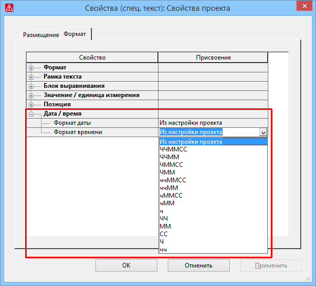

# Улучшенные свойства и форматирование для даты и времени

Для лучшего отображения отдельных элементов даты и времени было исправлено одно из свойств проекта и добавлено другое, а возможности форматирования для этих свойств усовершенствованы.

Эффект:

С помощью двух свойств проекта и новых настроек форматирования можно индивидуально и в соответствии с требованиями настраивать данные даты и времени в графическом редакторе и в рамках.

### Улучшенные свойства

Исправлена функция свойства проекта День недели (ид. 10027). Теперь это свойство в свойствах проекта или в виде вставленного специального текста в графическом редакторе, а также в рамке, отображает только дату. Чтобы в этих местах можно было отобразить текущее время в соответствии с заданным форматированием, используйте новое свойство проекта Время суток (ид. 10058).

Вставляя свойство Время суток в рамку, можно задокументировать время задания на печать для страниц проекта. Все страницы проекта, которые входят в задание на печать, отображаются в одно и то же время суток.

### Индивидуальные настройки формата

Кроме того, для свойств проекта, которые размещены в виде специального текста, доступны новые настройки форматирования. Для этого вкладка Формат под новым уровнем иерархии Дата / время была дополнена двумя свойствами отображения Формат даты и Формат времени.

По умолчанию для этих свойств установлен параметр "Из настройки проекта". В таком случае для свойства отображения даты / времени, которое размещается как ***специальный текст***, используется формат, заданный в [настройках проекта](xessettingsgui_d_einstellungenprojektdatum.md). В соответствующем раскрывающемся списке для обоих упомянутых выше свойств проекта День недели и Время суток можно выбрать индивидуальный формат даты и времени, к примеру "ГГГГ" для отображения года "2018". В этих списках доступны дополнительные форматы по сравнению с настройками проекта.

!!! note "Замечание:"

    Вкладка Отображение в диалоговом окне 'Свойства' устройств также была дополнена новым уровнем иерархии Дата / время. Но здесь формат даты может быть настроен индивидуально только для нескольких свойств отображения даты.
