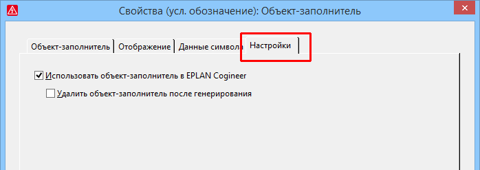

# Новые настройки для использования в EPLAN Cogineer

В EPLAN Cogineer объекты-заполнители используются в макросах для изменения данных при генерировании схем соединений или данных на сгенерированных страницах схем соединений. Чтобы управлять поведением объектов-заполнителей в EPLAN Cogineer, в диалоговом окне 'Свойства' объектов-заполнителей теперь доступна новая вкладка Настройки.

Эффект:

С помощью новой вкладки Настройки вы можете управлять использованием объектов-заполнителей в EPLAN Cogineer в соответствии с вашими требованиями.

Если установлен флажок Использовать объект-заполнитель в EPLAN Cogineer, то после добавления макроса объект-заполнитель становится доступным в EPLAN Cogineer и учитывается при генерировании схемы соединений в EPLAN Cogineer. В этом случае значения, присвоенные в EPLAN Cogineer, отображаются на объекте-заполнителе на сгенерированной странице схемы соединений.

Если эта настройка активирована, можно использовать вторую настройку Удалить объект-заполнитель после генерирования, чтобы указать, что соответствующий объект-заполнитель удаляется в EPLAN Cogineer после генерирования страниц схемы соединений.

**См. также:**

* [{: .ui-icon }
