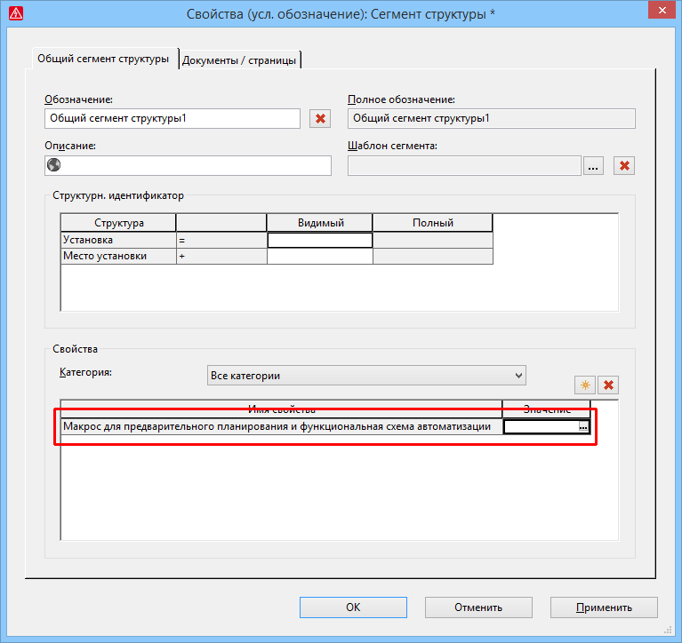

# Дополнить существующее предварительное планирование графическими представлениями и функциональными схемами автоматизации

Чтобы дополнить существующее предварительное планирование графическими представлениями и функциональными схемами автоматизации, теперь во ***всех*** сегментах предоставляется возможность сохранения макроса окна с графическим предварительным планированием или фрагментами функциональной схемы автоматизации.

Эффект:

С помощью нового свойства Макрос для предварительного планирования и функциональная схема автоматизации можно дополнить существующее предварительное планирование графическими представлениями и функциональными схемами автоматизации. Это, например, может пригодиться, когда импортированные данные предварительного планирования содержат разные варианты с одинаковыми подструктурами, для которых затем можно сохранить одинаковые или аналогичные макросы окон.

Для этого на первой вкладке в диалоговом окне 'Свойства' доступно новое свойство Макрос для предварительного планирования и функциональная схема автоматизации (ид. 44084). Если для свойства выбран макрос окна с видом представления "Предварительное планирование" и / или "Функциональная схема автоматизации", с помощью функции перетаскивания вы можете разместить этот сегмент на странице проекта соответствующего типа страницы вместе с фрагментами, имеющимися в макросе окна.

Чтобы при таком действии структуры в макросе могли быть присвоены структурам, имеющимся в проекте, должны быть соблюдены определенные [условия](planninggui_k_vorplanungerweitern.md).

При размещении макросов окна с данными функциональной схемы автоматизации открывается диалоговое окно Выбрать структуру. Если для размещаемого сегмента в структуре макроса окна на одном и том же уровне иерархии доступен соответствующий сегмент (одинаковое определение базового сегмента), а нижестоящие подструктуры одинаковы, то структуры из макроса в поле Проект автоматически размещаются в структуре предварительного планирования проекта.

**См. также:**

* [{: .ui-icon }
