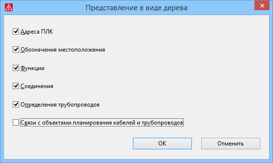

# Отображение связей с объектами планирования соединений и другими объектами в навигаторе предварительного планирования

С помощью связей в предварительном планировании становятся видимыми зависимости между различными сегментами. Чтобы в ***навигаторе предварительного планирования*** было видно, вводятся ли сегменты в качестве исходных или целевых сегментов для объектов планирования кабелей и трубопроводов, с помощью диалогового окна Представление в виде дерева можно отобразить связи с объектами планирования соединений.

Чтобы открыть это диалоговое окно, в навигаторе предварительного планирования выберите пункт всплывающего меню Представление в виде дерева. Установите флажок Связи с объектами планирования кабелей и трубопроводов и закройте диалоговое окно. После этого в представлении структуры дерева навигатора предварительного планирования под соответствующими сегментами отобразятся связи с объектами планирования кабелей и трубопроводов (пиктограмма: {: .ui-icon }).

### Показать или скрыть объекты в дереве

Вид в представлении структуры дерева навигатора предварительного планирования может быть неудобным для просмотра. Ввиду этого в диалоговом окне Представление в виде дерева существует возможность показывать или скрывать объекты, отображаемые по умолчанию для дерева, такие как адреса ПЛК, обозначения местоположения, функции и т. д., используя соответствующие флажки.

В соответствии с определением в этом диалоговом окне под сегментами отображаются или не отображаются другие объекты (адреса ПЛК, обозначения местоположения, функции и т. д.).

Эффект:

С помощью нового диалогового окна Представление в виде дерева можно индивидуально определить, какие объекты отображаются под сегментами в дереве навигатора предварительного планирования и таким образом наглядно сформировать дерево. Новые связи показывают, где находятся сегменты, введенные в качестве исходных или целевых сегментов для объектов планирования соединений.

**См. также:**

* [{: .ui-icon }
* [{: .ui-icon }
