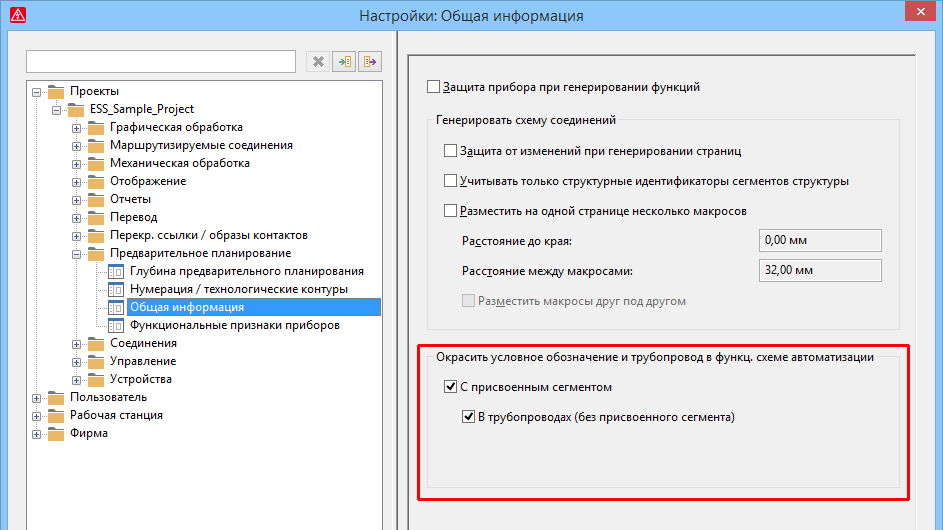

# Окрасить условное обозначение и трубопровод в функц. схеме автоматизации

Чтобы на функциональной схеме автоматизации распознать, какие резервуары, технологические контуры, трубопроводы и т. д. связаны с сегментами в предварительном планировании, эти условные обозначения и объекты на функциональной схеме автоматизации можно выделить цветом. Для этого в навигаторе предварительного планирования в диалоговом окне 'Свойства' сегмента выберите новой свойство Цвет для функциональной схемы автоматизации (ид. 44086) и установите требуемый цвет.

Эффект:

С помощью новых настроек для выделения цветом условных обозначений и трубопроводов на функциональной схеме автоматизации, а также нового свойства Цвет на функциональной схеме автоматизации можно визуализировать структуры из предварительного планирования, которые размещены на функциональной схеме автоматизации.

Чтобы связанные объекты на функциональной схеме автоматизации отображались в выбранном цвете, необходимо выполнить еще одну настройку. Для этого общее диалоговое окно 'Настройки' предварительного планирования было дополнено новым групповым полем Окрасить условное обозначение и трубопровод в функц. схеме автоматизации с двумя флажками (путь меню: Параметры > Настройки > Проекты > "Имя проекта" > Предварительное планирование > Общее).

Если установить новый флажок С присвоенным сегментом, все размещенные условные обозначения и трубопроводы, связь которых находится в навигаторе предварительного планирования под сегментом с выбранным цветом (свойство Цвет для функциональной схемы автоматизации), будут выделены этим цветом на функциональной схеме автоматизации. В навигаторе предварительного планирования обозначение и описание такого сегмента также будут отображаться в этом цвете.

Кроме того, в диалоговом окне 'Настройки' доступен новый флажок В трубопроводах (без присвоенного сегмента). Если установить этот флажок, для выделенных цветом трубопроводов дополнительно выделяются цветом условные обозначения, которые относятся к трубопроводу, но не связаны с сегментом в предварительном планировании.

!!! example "Пример:"

    На первом изображении представлен вид функциональнойсхемыавтоматизации перед выделением цветом.На следующем изображении показана настройка цвета для сегмента структурыHW02с помощью свойства Цвет для функциональной схемы автоматизациив навигаторе предварительного планирования.В групповом поле Окрасить условное обозначение и трубопровод в функц. схеме автоматизациидиалогового окна Настройки: Общее(предварительное планирование) установлены оба флажка. На изображении ниже показан результат выделения цветом в навигаторе предварительного планирования и на функциональной схеме автоматизации.

**См. также:**

* [{: .ui-icon }
