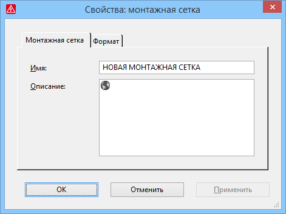

# Унифицированная и упрощенная вставка и обработка инструментов для монтажных работ

Для вставки и обработки инструментов для монтажных работ улучшены такие пункты:

* При определении точек монтажа, сборочных линий или монтажных сеток теперь возможно многократное размещение этих инструментов для монтажных работ.
* Теперь все инструменты для монтажных работ можно перемещать в ***проекте макросов***, точки монтажа, сборочные линии и монтажные сетки также можно дублировать.
* Диалоговые окна 'Свойства' инструментов для монтажных работ были упрощены и унифицированы. За исключением монтажной сетки, в этих диалоговых окнах теперь доступны только поля Имя и Описание.

Эффект:

Стандартизированные диалоговые окна и упрощенная обработка облегчают определение инструментов для монтажных работ.

### Упрощенное определение монтажных сеток

Ранее монтажная сетка определялась путем установления точек сетки. Теперь новую монтажную сетку при определении можно разместить свободно. После щелчка мышью по выбранной площади там отображаются точки захвата и обработчики на монтажной сетке, которую необходимо разместить.

Как и в случае с другими функциями, текущая точка захвата обозначена красными блоками, а возможные точки захвата — серыми блоками. С помощью клавиши ++A++ можно переключать точку захвата. Вы также можете определить точку захвата и смещение выбранной точки захвата относительно положения курсора с помощью известного диалогового окна Опции размещения.

#### Дальнейшие изменения и улучшения

* Диалоговое окно Монтажная сетка, которое открывается перед размещением, было изменено. Теперь вы можете определять монтажную сетку через поля Интервал сетки и Количество линий сетки в направлениях X и Y.
* Монтажные сетки теперь можно размещать несколько раз друг за другом так же, как и другие инструменты для монтажных работ.
* По завершении действия можно открыть диалоговое окно 'Свойства' для обработки свойств (например, для настройки автоматически назначенного имени). Это измененное диалоговое окно теперь имеет две вкладки. На второй вкладке Формат можно изменить интервал сетки и количество линий сетки в направлениях X и Y.
* В ***проекте макросов*** теперь можно перемещать и дублировать монтажные сетки.
* Для лучшего оптического распознавания на однорядных монтажных сетках теперь отображаются небольшие поперечные линии.

**См. также:**

* [{: .ui-icon }
* [{: .ui-icon }
