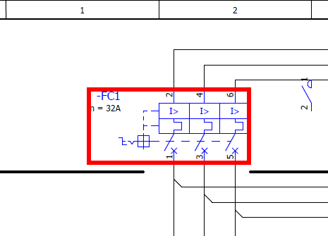

# Новые маркеры для целей перехода в PDF

В экспортированном PDF-документе цели перехода после перехода теперь обозначаются красной мигающей рамкой. Возможными целями перехода являются, например, устройства на страницах схем соединений, сгенерированные страницы устройств и т. д. Если в настройках для экспорта PDF установлен флажок Формат архивирования PDF/A, красные маркеры не генерируются. Кроме того, были реализованы дополнительные улучшения для экспорта PDF-документов, такие как изменение стандартных настроек.

Эффект:

Новые маркеры перехода и измененные стандартные настройки для экспорта облегчают ориентацию на экспортируемых страницах при переходах в PDF.

### Измененные стандартные настройки для экспорта PDF

В рамках этого расширения были также изменены ***стандартные настройки*** для экспорта PDF:

* Специфическая для пользователя настройка Использовать масштабирование теперь по умолчанию отключена.
* Для настройки Масштабирование значение "50,00 мм" / "1,9685 дюйма" заменено на "120,00 мм" / "4,7244 дюйма".

(Путь меню для диалогового окна 'Настройки': Параметры > Настройки > Пользователь > Интерфейсы > Экспорт PDF; вкладка Общ.).

### Переходы между главными и вспомогательными функциями двухмерных монтажных плат

В PDF-документах теперь возможны переходы между двухмерными монтажными платами, которые размещены как главные и вспомогательные функции на страницах типа "Компоновка электрошкафа".

### Отображение порядков свойств из пространства листа в трехмерном виде

Порядки свойств функциональных элементов в пространстве листа теперь можно распознать после экспорта PDF. Отображенные свойства трехмерной модели в PDF-файле идентичны отображению в пространстве листа.

**См. также:**

* [{: .ui-icon }
* [{: .ui-icon }
