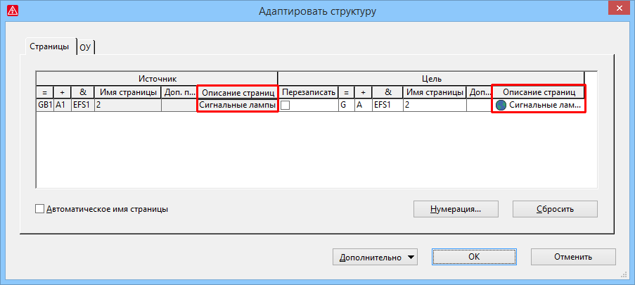

# Изменить описание страниц при копировании страниц

Если вы копируете страницы или вставляете макросы страницы в проекте, с помощью известного диалогового окна Адаптировать структуру перед вставкой страниц можно изменить структурные идентификаторы и номера страниц. Теперь во время этих операций можно также изменить описание страницы.

Эффект:

При вставке скопированных страниц или макросов страницы теперь можно напрямую адаптировать описания страниц. Дополнительная обработка соответствующих страниц больше не требуется.

Для этого диалоговое окно Адаптировать структуру на вкладке Страницы было дополнено двумя столбцами Описание страницы. В таблице Цель можно изменять многоязычные описания вставленных страниц.

**См. также:**

* [{: .ui-icon }
