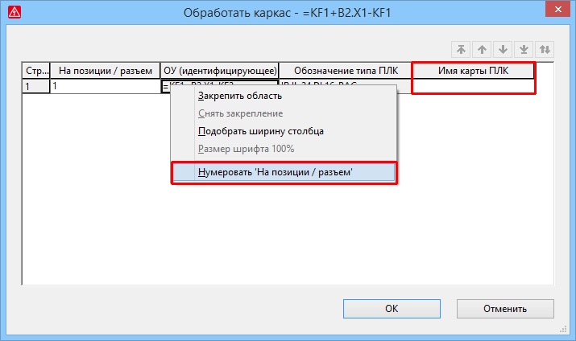

# Улучшения в диалоговом окне для обработки каркасов

В диалоговом окне Обработать каркас задайте последовательность карт ПЛК на каркасе. Это диалоговое окно было дополнено возможностью обработки имени карты ПЛК и автоматического присвоения значений свойства На позиции / разъем. С помощью этого свойства карты ПЛК располагаются на каркасе.

Эффект:

С помощью новых возможностей обработки распределение карт ПЛК на каркасе стало более удобным.

Чтобы открыть диалоговое окно обработки, в ориентированном на каркас виде навигатора ПЛК выделите каркас и выберите пункт всплывающего меню Обработать.

* В столбце Имя карты ПЛК отображаемое значение теперь можно изменить вручную.
* С помощью нового пункта всплывающего меню Нумеровать "На позиции / разъем" выделенным картам ПЛК или всему каркасу можно присваивать значения свойства На позиции / разъем автоматически. В последующем диалоговом окне вводится начальное значение и величина шага для нумерации.

**См. также:**

* [{: .ui-icon }
