# Основные данные: Символы

Этот раздел информирует о новых символах, которые в текущей версии доступны в основных данных.

!!! note "Замечание:"

    * На следующих страницах вы увидите некоторые представления новых символов из различных библиотек символов. На рисунках изображены соответствующие символы варианта "А" в однополюсном или многополюсном представлении. Под каждым рисунком приведены имя и номер символа.
    * Несколько символов имеют одинаковую графику символов. Однако эти символы различаются между собой относительно применения в разделах, определениях функций, свойствах символов и их позиций. Новые символы, имеющие одинаковую графику, представлены вместе.

Стандарты IEC-, ГОСТ- и GB

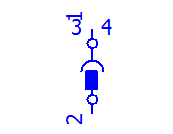 |  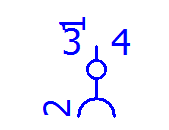 |  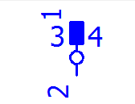 |  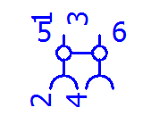
---|---|---|---
X2_STBU2 // 1360 |  X2_BU2 // 1364 |  X2_ST2 // 1365 |  X3_BU22 // 1368
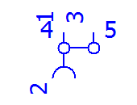 |  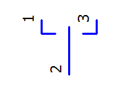 |  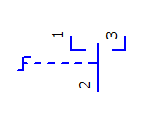 |  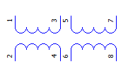
---|---|---|---
X3_BU12 // 1369 |  W3CO // 1592 |  SW3RCO // 1593 |  TS22 // 1609
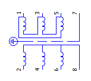 |  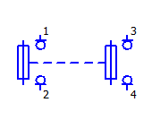 |  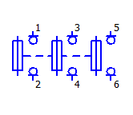 |  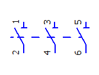
---|---|---|---
T3DRST_3 // 1614 |  FLTR_DU2 // 1618 |  FLTR_DU31 // 1619 |  QTR3_2 // 1621
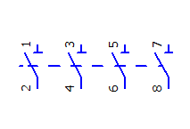 |  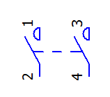 |  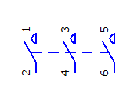 |  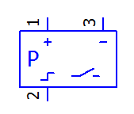
---|---|---|---
QTR4_1 // 1622 |  SL2 // 1624 |  SL3 // 1625 |  SSDS // 1627
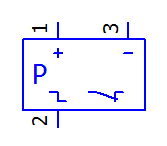 |  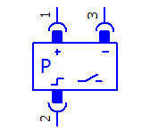 |  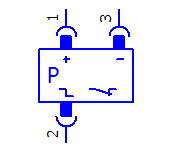
---|---|---
SODS // 1628 |  SSDSX // 1629 |  SODSX // 1630

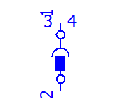 |  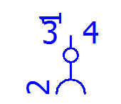 |   |  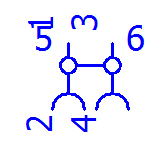
---|---|---|---
X2_STBU2 // 1360 |  X2_BU2 // 1364 |  X2_ST2 // 1365 |  X3_BU22 // 1368
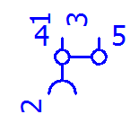 |  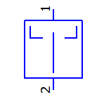 |  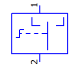 |  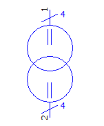
---|---|---|---
X3_BU12 // 1369 |  W3CO // 1592 |  SW3RCO // 1593 |  TS22 // 1609
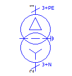 |  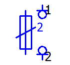 |  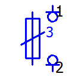 |  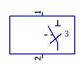
---|---|---|---
T3DRST_3 // 1614 |  FLTR_DU2 // 1618 |  FLTR_DU31 // 1619 |  QTR3_2 // 1621
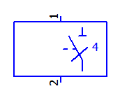 |  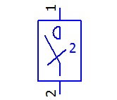 |  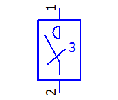 |  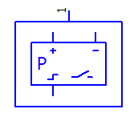
---|---|---|---
QTR4_1 // 1622 |  SL2 // 1624 |  SL3 // 1625 |  SSDS // 1627
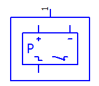 |  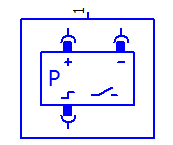 |  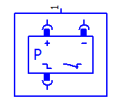
---|---|---
SODS // 1628 |  SSDSX // 1629 |  SODSX // 1630

* В следующих символах исправлено однополюсное представление графики:
M9SCHL_T // 1167
SCORD // 1215
M9_1STB // 1398
* В следующих символах исправлено представление образа контакта:
SL_EL // 1257
OL_EL // 1258
S_EL_2 // 1259
O_EL_2// 1260

* Для трех символов настроена логическая схема выводов устройства. При этом тип вывода устройства некоторых выводов устройства поменялся с "Жила / провод" на "Прямой вывод устройства". Это относится к таким символам:
FTR_DU3 // 1277
FLTR_DU3 // 1278
FLTR_DU31 // 1619
* Логическая схема выводов устройства также была адаптирована для перечисленных ниже символов. Записи для свойств Передать потенциал в и Отслеживание цели (ПЛК) в удалены:
KUB // 164
KUN // 165
KUB1 // 1469
KUN1 // 1470

Стандарт NFPA

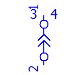 |  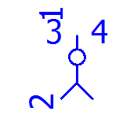 |  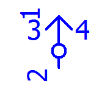 |  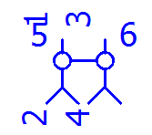
---|---|---|---
X2_STBU2 // 1360 |  X2_BU2 // 1364 |  X2_ST2 // 1365 |  X3_BU22 // 1368
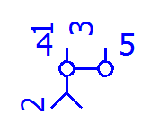 |  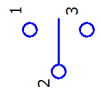 |  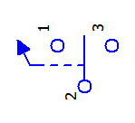 |  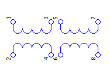
---|---|---|---
X3_BU12 // 1369 |  W3CO // 1592 |  SW3RCO // 1593 |  TS22 // 1609
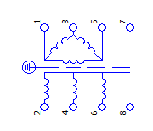 |  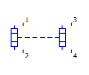 |  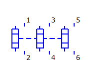 |  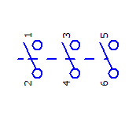
---|---|---|---
T3DRST_3 // 1614 |  FLTR_DU2 // 1618 |  FLTR_DU31 // 1619 |  QTR3_2 // 1621
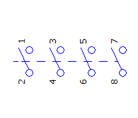 |   |   |  
---|---|---|---
QTR4_1 // 1622 |  SL2 // 1624 |  SL3 // 1625 |  SSDS // 1627
 |   |  
---|---|---
SODS // 1628 |  SSDSX // 1629 |  SODSX // 1630

 |   |   |  
---|---|---|---
X2_STBU2 // 1360 |  X2_BU2 // 1364 |  X2_ST2 // 1365 |  X3_BU22 // 1368
 |   |   |  
---|---|---|---
X3_BU12 // 1369 |  W3CO // 1592 |  SW3RCO // 1593 |  TS22 // 1609
 |   |   |  
---|---|---|---
T3DRST_3 // 1614 |  FLTR_DU2 // 1618 |  FLTR_DU31 // 1619 |  QTR3_2 // 1621
 |   |   |  
---|---|---|---
QTR4_1 // 1622 |  SL2 // 1624 |  SL3 // 1625 |  SSDS // 1627
 |   |  
---|---|---
SODS // 1628 |  SSDSX // 1629 |  SODSX // 1630

* В следующих символах исправлено однополюсное представление графики:
M9SCHL_T // 1167
SCORD // 1215
M9_1STB // 1398
* В следующих символах исправлено представление образа контакта:
SL_EL // 1257
OL_EL // 1258
S_EL_2 // 1259
O_EL_2// 1260

* Для трех символов настроена логическая схема выводов устройства. При этом тип вывода устройства некоторых выводов устройства поменялся с "Жила / провод" на "Прямой вывод устройства". Это относится к таким символам:
FTR_DU3 // 1277
FLTR_DU3 // 1278
FLTR_DU31 // 1619
* Логическая схема выводов устройства также была адаптирована для перечисленных ниже символов. Записи для свойств Передать потенциал в и Отслеживание цели (ПЛК) в удалены:
KUB // 164
KUN // 165
KUB1 // 1469
KUN1 // 1470

Fluid-Техника

 |   |   |  
---|---|---|---
PM13.1.1_15 // 789 |  PM13.1.1_16 // 790 |  PM13.1.1_17 // 791 |  PM13.1.1_18 // 792
 |   |   |  
---|---|---|---
PM13.1.1_19 // 793 |  PM13.1.1_20 // 794 |  PM13.1.1_21 // 795 |  PM13.1.1_22 // 796
 |   |  
---|---|---
PM13.1.1_23 // 797 |  PM13.1.1_24 // 798 |  PM13.1.1_25 // 799

 |   |  
---|---|---
F15.3.1 // 256 |  V_BT_023_R1 // 376 |  RS1.1 // 1489

---
F15.3.1 // 256

* В библиотеке символов "PNE1ESS" заблокированы такие символы:
V_BT_023_R1_d // 162
F15.3.1_d // 254
* В библиотеке символов "LUB1ESS" заблокирован такой символ:
F15.3.1_d // 254

Технология производственных процессов и автоматизация зданий

 |   |   |  
---|---|---|---
KHL_26 // 1402 |  KHL_27 // 1403 |  KHL_28 // 1404 |  KHL_29 // 1405
 |   |   |  
---|---|---|---
WMT_24 // 1407 |  WMT_25 // 1408 |  WMT_26 // 1409 |  WMT_27 // 1410

* Графика символа ZT_02 / 1168 адаптирована под стандарт DIN EN ISO 10628-2:2013-04.

Библиотека специальных символов

 |   |  
---|---|---
PLCCPNGV2 // 215 |  PLCCPING // 216 |  PLCFCPING // 598

Графика последних двух символов отображается, только если включен параметр Вид > Невидимые элементы.

 |  
---|---
AR1 // 302 |  AR2 // 303

---
CDPCPKOAX // 546

---
PBR // 547

 |   |   |  
---|---|---|---
PID1BAN_01 // 581 |  PID1BAN_02 // 582 |  PID1BAN_03 // 583 |  PID1BAN_04 // 584
 |   |   |  
---|---|---|---
PID1BAN_05 // 585 |  PID1BAN_06 // 586 |  PID1BAN_07 // 587 |  PID1BAN_08 // 588

 |   |   |  
---|---|---|---
PLCFCP // 591 |  NWBFCP // 601 |  PLCFC1 // 611 |  PLCFC2 // 612
