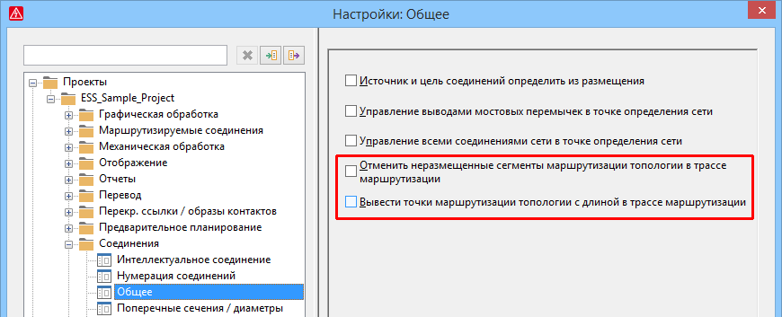

# Более детальные настройки для трассы маршрутизации

В свойстве Топология: Трасса маршрутизации перечислены сегменты маршрутизации топологии, через которые проходят соединения или кабели, маршрутизируемые в сети соединенных сегментов. Теперь для трассы маршрутизации доступны более детальные настройки:

* В трассе маршрутизации ранее отображались и неразмещенные сегменты маршрутизации. Неразмещенные сегменты маршрутизации топологии появляются, например, при [генерировании функций топологии](cablinggui_h_strukturenverbinden.md) в точках маршрутизации структурного идентификатора. Теперь неразмещенные сегменты маршрутизации можно скрывать в трассе маршрутизации.
* Кроме того, в трассе маршрутизации ранее не учитывалась длина точек маршрутизации или точек маршрутизации структурного идентификатора топологии. Теперь в трассе маршрутизации можно выводить точки маршрутизации или точки маршрутизации структурного идентификатора топологии с соответствующей длиной.

С этой целью в настройках проекта для соединений стал доступен новый флажок Отменить неразмещенные сегменты маршрутизации топологии в трассе маршрутизации и Вывести точки маршрутизации топологии с длиной в трассе маршрутизации. Путь меню для этих настроек: Параметры > Настройки > Проекты > "Имя проекта" > Соединения > Общее.

Эффект:

* С помощью новой настройки проекта Отменить неразмещенные сегменты маршрутизации топологии в трассе маршрутизации в отчетах можно выводить только те трассы маршрутизации, которые размещены на страницах.
* С помощью новой настройки проекта Вывести точки маршрутизации топологии с длиной в трассе маршрутизации в отчетах можно выводить длину в пределах точки маршрутизации.

### Отменить неразмещенные сегменты маршрутизации топологии в трассе маршрутизации

Если этот флажок установлен, неразмещенные сегменты маршрутизации топологии скрываются в свойстве Топология: Трасса маршрутизации (ид. 20237) и, таким образом, не выводятся в отчетах.

### Вывести точки маршрутизации топологии с длиной в трассе маршрутизации

Если этот флажок установлен, точки маршрутизации топологии и точки маршрутизации структурного идентификатора топологии, на которых введена длина, выводятся вместе в свойстве Топология: Трасса маршрутизации (ид. 20237).

Если дополнительно активирована настройка Отменить неразмещенные сегменты маршрутизации топологии в трассе маршрутизации, в трассе маршрутизации выводятся только ***размещенные*** точки маршрутизации топологии и точки маршрутизации структурного идентификатора топологии.

**См. также:**

* [{: .ui-icon }
