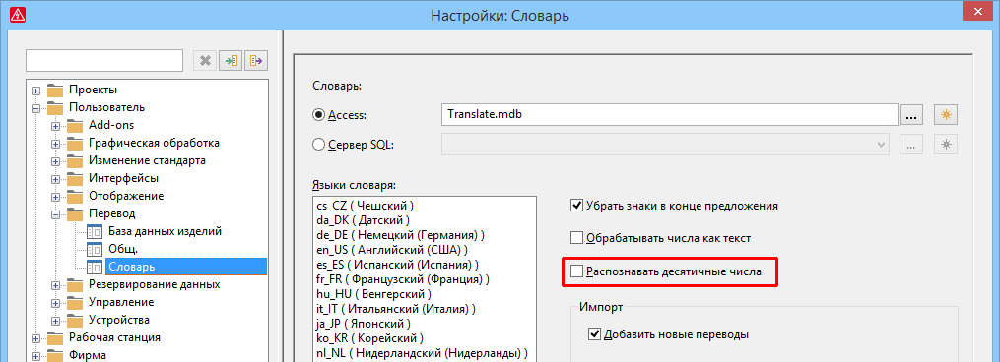

# Распознавание десятичных чисел при переводе

Для перевода текстов, которые отличаются только числовыми значениями, в словарь можно заносить ключевые слова с заполнителями (напр. Voltage %0V). При этом заполнитель %0 ранее использовался для любой строки цифровых символов (например, 12 или 240 и т. д.). Теперь такой заполнитель может также использоваться для чисел, которые содержат, например, запятую, точку, косую черту или предшествующий знак (например, 12; 2,5; +-2.5; 3/4 и т. д.).

Эффект:

При использовании новой настройки для распознавания десятичных знаков в словаре будет значительно меньше ключевых слов для однотипных текстов с различными комбинациями чисел и символов.

В настройках пользователя для словаря появилась новая настройка Распознавать десятичные числа. Путь меню для этой настройки: Параметры > Настройки > Пользователь > Перевод > Словарь.

Если этот флажок установлен, десятичные числа и числа с предшествующими знаками будут распознаваться при переводе. Числа, содержащие как минимум одну цифру и любую комбинацию символов, таких как запятая, точка, плюс, минус и косая черта ("/") без пробелов между ними, считаются ***одним*** числом. Для перевода текстов, содержащих такие десятичные числа, в словаре требуется только ключевое слово с заполнителем %0. Таким образом, с помощью ключевого слова Voltage %0V можно перевести несколько слов, например Voltage 12V, Voltage 2.5V, Voltage +12V.

Если флажок снят, последовательности цифр будут распознаваться только в виде отдельных чисел, как это было ранее. В этом случае в словаре потребуется несколько ключевых слов для возможных комбинаций чисел и символов. Например, если число содержит запятую, последовательности цифр до и после запятой будут интерпретироваться как отдельные числа.

**См. также:**

* [{: .ui-icon }
* [{: .ui-icon }
