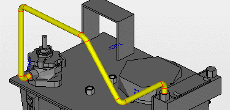
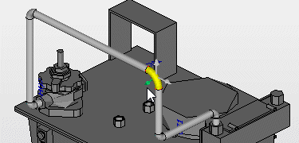
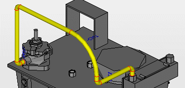
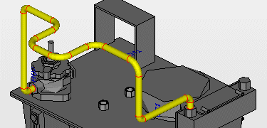

# Изменить колена труб

Чтобы изменять профиль трубопровода в соответствии с установочным положением, можно изменять, дополнительно вставлять и удалять содержащиеся в нем колена труб.

Условия:

* Вы открыли проект. Открыто одно пространство листа.
* Пространство листа содержит свободно маршрутизируемые трубопроводы.

1. Выберите следующие пункты меню: Обработать > Графика > Изменить место изгиба
2. Чтобы изменить положение места изгиба на трубопроводе, установите курсор над коленом трубы.

!!! info "Для сведения:"

    Сегмент выделяется цветом.

3. Щелкните по колену трубы.

!!! info "Для сведения:"

    Появятся две стрелки вдоль осей обоих сегментов труб и третья стрелка для изменения радиуса изгиба.

4. Щелкнув по зеленой стрелке, выберите направление, в котором следует переместить колено трубы.

!!! info "Для сведения:"

    Сегмент можно переместить в выбранном направлении стрелки.

5. Щелкните по требуемой конечной точке для перемещения или введите угол в область ввода данных.

!!! info "Для сведения:"

    Колено трубы перемещается в выбранное положение, а прилегающие сегменты и угол колен труб изменяются соответственно.

1. Выберите следующие пункты меню: Обработать > Графика > Изменить место изгиба
2. Чтобы изменить радиус изгиба на трубопроводе, установите курсор над коленом трубы.
3. Щелкните по колену трубы.
4. Щелкните по зеленой стрелке, которая в углу колена трубы указывает внутрь.

!!! info "Для сведения:"

    Радиус колена трубы можно увеличить или уменьшить движением курсора.

5. Щелкните по требуемой конечной точке для изменения радиуса или введите новое значение в область ввода данных.

!!! info "Для сведения:"

    Радиус колена трубы изменится, а вместе с ним и положение прилегающих сегментов.

!!! info "Для сведения:"

    Если радиус изгиба, определенного в изделии, меньше минимально допустимого значения, то колено трубы отображается в голубом цвете.

1. Выберите следующие пункты меню: Обработать > Графика > Новое место изгиба
2. Чтобы вставить новое место изгиба в прямой сегмент трубопровода, установите курсор над сегментом.
3. Щелкните по сегменту.
4. Щелкнув по зеленой стрелке, выберите направление, в котором следует вставить новое место изгиба.

!!! info "Для сведения:"

    Сегмент разделится на три части; среднюю треть можно переместить в выбранном направлении.

5. Щелкните по требуемой конечной точке для перемещения или введите значение интервала в область ввода данных.

!!! info "Для сведения:"

    Средняя треть сегмента переместится в требуемое положение.

!!! info "Для сведения:"

    Вставляются 4 новых колена труб, которые соединяют сегмент детали с трубопроводом.

1. Выберите следующие пункты меню: Обработать > Графика > Удалить место изгиба
2. Щелкните по месту изгиба, которое необходимо удалить.

!!! info "Для сведения:"

    Колено трубы удаляется и заменяется на прямой сегмент, а прилегающие сегменты и колена труб изменяются соответственно.
