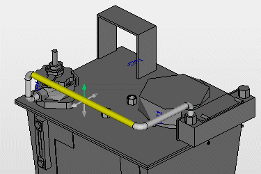
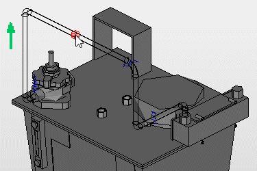
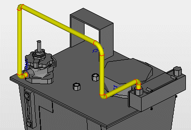

# Изменить трубопроводы

Профиль свободно маршрутизируемого трубопровода можно изменять графически или при помощи ввода данных в область ввода. Графическое изменение трубопровода возможно параллельно осям X, Y и Z между источником и целью. Полученный в результате свободной маршрутизации трубопровод может быть оптимизирован с минимальным количеством дальнейших шагов обработки, чтобы получить окончательный профиль трубопровода. При обработке трубопровода режим конструкции также можно использовать вместе с включенным захватом объекта.

Возможно следующее:

* Выбор сегмента трубы в слое обоих прилегающих сегментов
* Перемещение выбранного сегмента трубы свободно маршрутизируемого трубопровода
* Ортогональное и неортогональное перемещение мест изгибов / колен трубы
* Изменение радиуса изгиба мест изгибов / колен трубы
* Вставка и удаление дополнительных сегментов / колен трубы.

Условия:

* Вы открыли проект. Открыто одно пространство листа.
* Пространство листа содержит свободно маршрутизируемые трубопроводы.

### Переместить сегмент трубы / место изгиба

Принципы работы при перемещении сегментов и мест изгиба идентичны. В качестве примера здесь описывается перпендикулярное перемещение сегмента трубы.

1. Выберите следующие пункты меню: Обработать > Графика > Изменить место изгиба
2. Чтобы изменить положение сегмента трубы на трубопроводе, установите курсор над сегментом.

!!! info "Для сведения:"

    Сегмент выделяется цветом.

3. Щелкните по сегменту.

!!! info "Для сведения:"

    В центре сегмента появляются стрелки, расположенные в четырех ортогональных направлениях.

4. Щелкнув по зеленой стрелке, выберите направление, в котором следует переместить сегмент.

!!! info "Для сведения:"

    Сегмент можно переместить в выбранном направлении стрелки.

5. Щелкните по требуемой конечной точке для перемещения или введите значение интервала в область ввода данных.

!!! info "Для сведения:"

    Сегмент трубы / место изгиба перемещается в требуемое положение, прилегающие сегменты изменяются соответственно.

