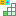
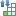
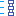
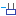
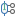
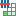
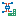

# Диалоговое окно Предварительное планирование — <Имя проекта>

Данные проекта > Предварительное планирование > Навигатор.

В этом диалоговом окне в представлении в виде дерева или списка по вашему выбору можно просмотреть и обработать определенные в проекте сегменты структуры и объекты планирования.

Обзор основных элементов диалогового окна:

На вкладке Дерево иерархически отображаются сегменты структуры и объекты планирования. Самым верхним уровнем иерархии является проект, ниже можно создавать сегменты структуры и объекты планирования. Сегменты структуры нельзя располагать под объектами планирования.

Под объектами планирования отображаются их адреса ПЛК и шаблоны функции. Предварительно установленная пиктограмма показывает, сохранен ли в объекте планирования макрос. Такой макрос можно разместить в Графическом редакторе при помощи мыши. При этом для размещения предлагается вид представления, подходящий к типу страницы.

Сегменты сортируются по умолчанию внутри структуры сначала по своему основному определению, а затем — по своему обозначению. Последовательность основных определений выглядит следующим образом:

* Сегменты структуры
* Резервуары
* Технологические контуры
* Функции ТК
* Объекты планирования
* Объекты планирования, соединения (объекты планирования, трубопроводы; объекты планирования, кабели).

Для сортировки технологических контуров вместо полного обозначения учитываются только его идентифицирующие элементы. Дополнительные идентифицирующие свойства, помимо номера, можно задать в диалоговом окне Настройки: Нумерация / Технологические контуры. При помощи кнопок со стрелками можно изменить сортировку сегментов ниже узла в структуре дерева. Такая сортировка вручную имеет приоритет.

!!! tip "Совет:"

    В представлении в виде дерева навигатора предварительного планирования можно перемещать сегменты на другое место также при помощи мыши. Если при перетаскивании нажать и удерживать клавишу ++Ctrl++, то выделенные сегменты будут скопированы.

  Пиктограмма |  Значение
---|---
{: .ui-icon } |  Обозначает уровень проекта.
{: .ui-icon } |  Сегмент структуры
{: .ui-icon } |  Объект планирования
{: .ui-icon } |  Технологический контур
{: .ui-icon } |  Функция ТК
{: .ui-icon } |  Резервуар
{: .ui-icon } |  Объект планирования, трубопровод
{: .ui-icon } |  Объект планирования, кабель
{: .ui-icon } |  Сегмент, многократно размещенный на страницах предварительного планирования, или нижестоящий сегмент, размещенный за пределами вышестоящих блоков на странице предварительного планирования.
{: .ui-icon } |  Неприсвоенное детальное планирование. Обозначает объекты из детального планирования, соответствующие сегменты которых были удалены. Под этим узлом отображаются неприсваиваемые объекты (страницы, функции и т. д.).
{: .ui-icon } |  Связь, то есть ссылка на уже имеющийся сегмент в другой структуре.
{: .ui-icon } |  Макрос. Эта пиктограмма отображается, когда на объекте планирования сохранен макрос.
{: .ui-icon } {: .ui-icon } |  Шаблон функции для главной функции. Эта пиктограмма отображается, если на объекте планирования записаны шаблоны функции или изделия, на которых сохранены шаблоны функции.
{: .ui-icon } |  Шаблон функции для вспомогательной функции. Эта пиктограмма отображается, если на объекте планирования записаны шаблоны функции или изделия, на которых сохранены шаблоны функции.
{: .ui-icon } |  Адрес ПЛК. Эта пиктограмма отображается, когда на объекте планирования записаны адреса ПЛК.
{: .ui-icon } |  Обозначение местоположения. Пиктограмма отображается, если сегмент структуры размещен на функциональной схеме автоматизации как обозначение местоположения.
{: .ui-icon } |  Точка определения трубопровода. Пиктограмма отображается, если объект планирования (трубопровод) размещен на функциональной схеме автоматизации как точка определения трубопровода.
{: .ui-icon } |  Вывод трубопровода. Пиктограмма отображается, если объект планирования (трубопровод) на функциональной схеме автоматизации присвоен выводу трубопровода.
{: .ui-icon } |  Внешний документ. Эта пиктограмма отображается, когда на объекте планирования сохранен внешний документ.

(Обзор основных пиктограмм для данных проекта вы найдете в разделе [Пиктограммы для навигаторов](userinterface_k_iconsnavigatoren.md).)

!!! tip "Совет:"

    Неприсвоенные объекты из детального планирования, сегменты которых были удалены, не имеют свойств. С помощью пункта меню всплывающего меню Перейти к (графика) можно перейти к схеме соединений и там обработать подробное планирование. Кроме того, с помощью пунктов всплывающего меню Разделить и Удалить можно убрать присвоение предварительному планированию или навсегда удалить более не присваиваемый объект.

На вкладке Список по умолчанию отображаются имя определения сегмента, обозначение и описание, а также структурные идентификаторы для блоков идентификаторов "Установка" и "Место установки". Дополнительно можно вывести структурные идентификаторы для других блоков идентификаторов, а также другие свойства сегментов структуры и объектов планирования (например, свойства Техническое описание, Расход энергии или определенные пользователем свойства). В представлении в виде списка значения свойств доступны для непосредственной обработки.

### Фильтр

В этом раскрывающемся списке отображаются все доступные фильтры. Выбранный фильтр активируется автоматически и применяется как к дереву, так и к списку. Запись "- Не активировано -" отключает фильтр и приводит к тому, что данные отображаются в неотфильтрованном виде. С помощью кнопки ++...++ откройте диалоговое окно [Фильтр](modaldialogsdb_d_filternnach.md). Здесь можно создать, обработать, удалить, скопировать, экспортировать, импортировать фильтр и управлять им.

Во всплывающем меню раскрывающегося списка Фильтр содержатся следующие записи:

* Выключить: Этот пункт меню доступен, если фильтр установлен: Сбрасывает настройку фильтра до записи "- Не активировано -".
* Активировать <Имя фильтра>: Этот пункт меню доступен, если для настройки фильтра установлено значение "- Не активировано -": Повторно активирует последний активный фильтр.

Таким образом можно быстро переключаться между неотфильтрованным и отфильтрованным в соответствии с требованиями пользователя представлениями.

Если в представлении в виде дерева в результате фильтрации был скрыт сегмент структуры или объект планирования, то нижестоящие сегменты структуры и объекты планирования также будут скрыты. В представлении в виде списка нижестоящие сегменты структуры и объекты планирования в этом случае скрыты ***не*** будут.

### Значение: <Свойство>

При помощи [быстрого ввода](modaldialogsdb_k_filter.md) в данном поле для определенного и активированного фильтра можно быстро изменить значение его критерия.

### Всплывающее меню

Всплывающее меню дает доступ, в зависимости от типа поля (например, дата, целое число, многоязычный), к пунктам меню, при помощи которых вы можете по необходимости, например, влиять на представление таблиц или обрабатывать значения в полях. Обзор пунктов этого всплывающего меню вы можете найти в разделе [Пункты всплывающего меню](userinterface_m_kontextmenu.md).

Дополнительно здесь представлены следующие пункты всплывающего меню, специфические для данного диалогового окна:

Пункт меню |  Значение
---|---
Новый сегмент структуры |  Позволяет создать новый сегмент структуры. Если в проекте имеется несколько определений сегментов, то сначала открывается диалоговое окно Выбрать определение сегмента для выбора нужного определения сегмента. Затем открывается диалоговое окно Свойства (усл. обозначение): Сегмент структуры. Оно позволяет обрабатывать свойства нового сегмента структуры.
Новый объект планирования |  Позволяет создать новый объект планирования. Если в проекте имеется несколько определений сегментов, то сначала открывается диалоговое окно Выбрать определение сегмента для выбора нужного определения сегмента. Затем открывается диалоговое окно Свойства (усл. обозначение): Объект планирования. Оно позволяет обрабатывать свойства нового объекта планирования.
Новое устройство (объект планирования) |  Открывает диалоговое окно Выбор изделия. Позволяет создать объект планирования с изделием. Если в проекте имеется несколько определений сегментов, то откроется диалоговое окно Выбрать определение сегмента для выбора необходимого определения сегмента.
Копировать / Вставить |  Соответствует знакомым функциям Windows для обработки записей данных. Позволяет копировать сегменты структуры и объекты планирования в навигаторе предварительного планирования. При копировании сегментов структуры копируется также и полная подчиненная структура.
Вставить связь (только дерево) |  Вставляет скопированный сегмент в виде связи. С помощью связей можно указывать путь к уже имеющимся сегментам в других структурах.
Дублировать |  Дублирует структуру в рамках выделенного сегмента структуры или объекта планирования. При этом обозначения и структурные идентификаторы автоматически считаются по нарастающей.
Удалить |  Удаляет все выделенные сегменты или — в представлении в виде дерева — все сегменты, расположенные ниже выделенного уровня в виде дерева. (Возможен многократный выбор сегментов или уровней структуры дерева.)
Переименовать (только дерево) |  С помощью этого пункта меню можно переименовать обозначение выделенного сегмента. После переименования структура дерева обновляется.
Разместить |  Размещает для выделенного объекта планирования или выделенного шаблона соответствующие функции на схеме соединений. Или помещает сам сегмент на страницу предварительного планирования либо введенный на сегменте макрос / макрос изделия на страницу проекта. Непосредственно перед размещением нажмите клавишу ++Shift++, чтобы запустить операцию размещения в режиме "Отдельные функции". Нажмите ++Backspace++, чтобы открыть диалоговое окно Разместить устройство и, например, Выбор макросов (при необходимости) или изменить вид представления.

!!! note "Замечание:"

    * Чтобы сегмент с введенным макросом / макросом изделия можно было разместить на странице проекта, макрос должен иметь соответствующий вид представления для страницы проекта.
    * При размещении макросов, как правило, вместе с ними размещаются рамки макросов. С помощью рамки макроса идентифицируются содержащиеся в нем функции, объекты-заполнители и т. д., и при необходимости их можно обновить в подробном планировании.

Разместить (устройство) |  Это действие возможно только для объектов планирования, на которыми не сохранено ни одно изделие. При наличии шаблонов у объекта планирования вызывается окно "Выбор устройства". При отсутствии шаблонов у объекта планирования вызывается окно "Выбор изделия". Затем можно разместить функции выбранного изделия. Изделие присваивается главной функции и не сохраняется на объекте планирования.
Функциональное размещение |  Ищет макрос изделия в виде представления "Функциональный" и размещает его через следующее меню на схеме соединений в виде графики символа или макроса. Непосредственно перед размещением нажмите клавишу ++Backspace++, чтобы открыть окно выбора символа или макроса, и выберите другой символ / макрос.
Генерировать новую страницу из макроса (только список) |  Этот пункт меню доступен, если на выделенном объекте планирования записан макрос. Создает новую страницу схемы соединений. При этом макрос, сохраненный на объекте планирования, размещается на этой странице. Имя страницы автоматически получается из структурного идентификатора объекта планирования. Возможен многократный выбор.
Обновить данные заполнителя |  Обновляет данные объектов-заполнителей для выбранных объектов планирования. Измененные данные объектов-заполнителей переносятся из уже присвоенных макросов на сегменты. Это означает, что нет необходимости открывать сегменты с сохраненными макросами по отдельности и обновлять данные.
Обновить детальное планирование |  Передает измененные данные из предварительного планирования на объекты в детальном планировании, связанные с выделенными здесь сегментами. При этом учитывается и выделенный сегмент, и все подчиненные сегменты. Также возможен многократный выбор сегментов. В открывшемся диалоговом окне [Обновить детальное планирование](planninggui_d_detailplanungaktualisieren.md) задайте объем обновления.
Присвоить |  Присваивает выбранный сегмент функции на странице проекта или 3D-размещению изделия в пространстве листа. [Назначить сегменты / объекты](planninggui_h_objektezuweisen.md)
Разделить |  Разделяет функцию или 3D-размещение изделия связанного сегмента.
Нумеровать технологические контуры |  Нумерует выбранные в навигаторе технологические контуры заново. При этом настройки для нумерации используются на вкладке Нумерация / доступность диалогового окна [Конфигурировать определения сегмента](planninggui_d_konfigsegmentdef.md).
Сбросить на шаблон сегмента |  Сбрасывает измененные значения сегмента снова на значения, предварительно определенные в шаблоне сегмента.
Изменить определение сегмента |  Открывает диалоговое окно Выбрать определение сегмента и позволяет присвоить сегменту другое определение. (Для сегментов с одинаковым базовым определением возможен многократный выбор.)
Создать макрос предварительного планирования |  Создает макрос предварительного планирования, содержащий выделенный сегмент структуры или объект планирования и лежащую ниже структуру.
Вставить макрос предварительного планирования |  Открывает диалоговое окно Выбрать макрос предварительного планирования и вставляет выбранный макрос ниже выделенного сегмента структуры или объекта планирования. В объекты планирования нельзя вставить макросы, содержащие сегменты структуры.
Перейти к (перекрестная ссылка) |  Заносит сегменты с перекрестными ссылками и функции в список Перейти к и открывает его. В нем выводятся все размещения сегмента, связанные с ним функции и соответствующие записи в отчетах предварительного планирования.
Перейти к (все виды представлений) |  Заносит все виды представлений сегмента или функции (например, на странице предварительного планирования и странице отчета) в список Перейти к и открывает его.
Перейти к (графика) |  Отображает местоположение выделенного сегмента или выделенной функции в Графическом редакторе.
Представление в виде дерева (только дерево) |  Открывает диалоговое окно [Представление в виде дерева](planninggui_h_verknuepfungenanzeigen.md), в котором можно указать, какие объекты и связи отображаются в представлении структуры дерева под сегментами.
Список с предварительным выбором (только дерево) |  Уменьшает число отображаемых элементов, чтобы ускорить ориентирование в представлении в виде списка. Если этот параметр активирован, представление в виде списка вызывается с автоматическим фильтром (предварительный выбор), причем этот фильтр содержит только что выбранные элементы.
Выбрать в дереве (только список) |  Показывает выделенный объект во вкладке Дерево.
Конфигурировать представление |  Открывает диалоговое окно Конфигурировать представление, в котором можно задать, какие свойства должны отображаться в представлении в виде списка и в представлении структуры дерева.

!!! note "Замечание:"

    Учтите, что при конфигурации ***представления структуры дерева*** в диалоговом окне Конфигурировать представление представление сегментов ***не*** конфигурируется; можно только определить свойства, которые должны отображаться в дереве для других объектов (проектов, функций, обозначений местоположения, определений трубопроводов и т. д.). Сегменты задаются в диалоговом окне [Конфигурировать определения сегмента](planninggui_d_konfigsegmentdef.md) с помощью поля Формат отображения навигатора в том же виде, в котором они представлены в дереве навигатора предварительного планирования.

Табличная обработка |  Открывает табличную обработку с возможностью обрабатывать свойства выделенных объектов.
Свойства |  Открывает диалоговое окно Свойства (усл. обозначение): ++...++. Позволяет обрабатывать свойства сегмента или функции.
Свойства (общие) |  Открывает диалоговое окно Свойства (общие): ++...++. Позволяет обрабатывать свойства устройства.

**См. также:**

* [Предварительное планирование](planninggui_k_start.md)
* [Создание и обработка сегментов структуры](planninggui_h_struktursegmenteerstlbearb.md)
* [Создание объектов планирования, технологических контуров, функций ТК, резервуаров и объектов планирования (соединений)](planninggui_h_planungsobjekteerstellen.md)
* [Создание связей в предварительном планировании](planninggui_h_verknuepfungenerstellen.md)
* [Размещение шаблонов функций и адресов ПЛК объектов планирования](planninggui_h_objekteplatzieren.md)
* [Создание и вставка макросов предварительного планирования](planninggui_h_vorplanmakroserstl.md)
* [Определения трубопровода на функциональной схеме автоматизации](planningri_k_rdp.md)
* [[Функция перетаскивания мышью](userinterface_k_dragdropfunktionen.md)
